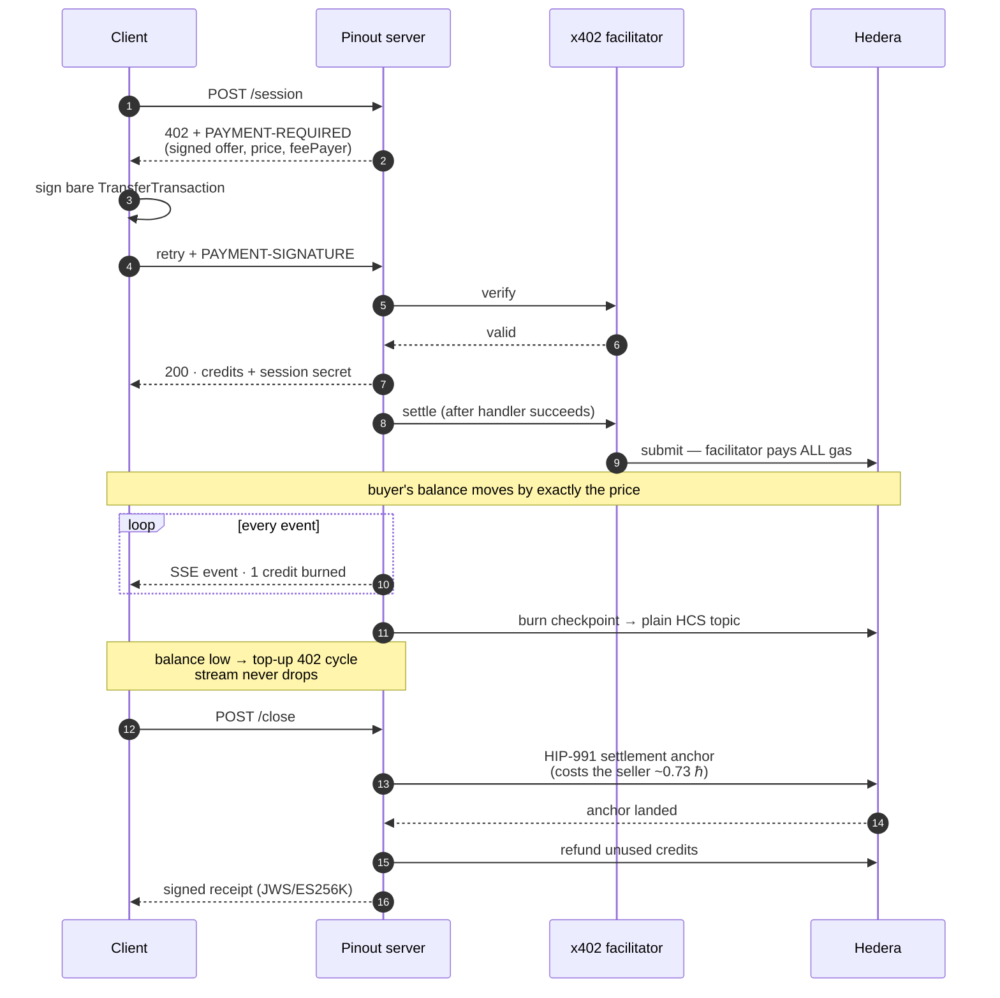
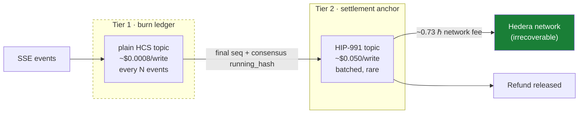
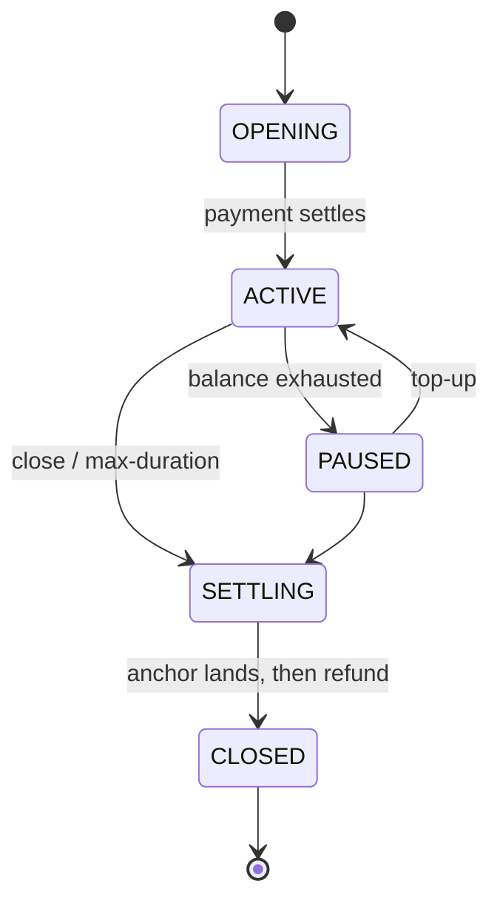
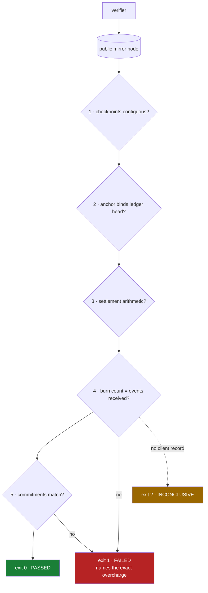

<div align="center">

# Pinout

**A prepaid meter for anything that streams — settled over [x402](https://x402.org) on [Hedera](https://hedera.com).**

[](./LICENSE)
[](https://docs.x402.org)
[](https://hashscan.io/testnet)
[](https://nodejs.org)

One payment buys credits · a live stream burns them per event · the client tops up
mid-stream without dropping the connection · unused credits are refunded on-chain ·
and anyone can recompute the bill from the public ledger.

</div>

---

## The problem

x402 pays for **one thing, once**. That breaks the moment consumption is continuous:

- **You can't sign a payment per token.** The latency and fee overhead destroy the use case.
- **You can't pay upfront.** Neither party knows how long the stream will run.

This isn't a hypothesis. Hedera's own x402 documentation lists it under *Constraints*:

> Discrete per-request design (**not streaming** or multi-hop routing)

[x402 issue #2273](https://github.com/x402-foundation/x402/issues/2273) proposes the fix —
`metered-session`, prepaid sessions with auto-refund — and has sat **open with zero
comments** since May 2026. Its first named use case is *"LLM token streams"* and its
`unit` enum already contains `token`.

Pinout implements that proposal, and answers its open questions with measurements.

---

## How it works



The refund is **gated behind the anchor**. The seller cannot keep an unused balance
without paying to publish its final numbers on an immutable ledger.

---

## The two-tier ledger

The original design checkpointed everything to a HIP-991 fee-charging topic.
Measurement killed it:

| Payload | Plain HCS topic | HIP-991 topic |
|--------:|----------------:|--------------:|
|   100 B |       $0.00017  |    **$0.0500** |
| 1,000 B |       $0.00078  |    **$0.0500** |
| 4,000 B |       $0.00080  |    **$0.0500** |

A fee-charging topic costs a **flat ~$0.050 per message — 62× a plain topic —
independent of payload size *and* of the fee amount.** So the meter is split:



Tier 2 embeds tier 1's final `sequence_number` and consensus `running_hash`, so burn
history cannot be restated without invalidating the anchor that committed to it.

**Both tiers are HCS. There is no smart contract anywhere in this system.**

---

## Quickstart

```bash
git clone https://github.com/hitakshiA/pinout.git
cd pinout && npm install
cp .env.example .env        # fill in accounts, or use real env vars
npm run check-config
```

You need two funded Hedera **testnet** accounts with **ECDSA (secp256k1)** keys.
Get one from [portal.hedera.com](https://portal.hedera.com), then:

```bash
node scripts/new-role-account.mjs SELLER 60   # creates + funds the seller
```

Run the full flow — it prints a HashScan link for every on-chain step:

```bash
npm run e2e
npm run verify -- <sessionId>
```

### Watch it catch a cheating seller

```bash
npm run e2e -- --cheat 400        # seller inflates the ledger
npm run verify -- <sessionId>     # exits 1
```

```
1. contiguity              PASS
2. tier binding            PASS
3. settlement arithmetic   PASS
4. ledger vs received      FAIL  claims 3000, client received 2600
                                 (+400 phantom = 80000 tinybar overcharge)
5. checkpoint commitments  FAIL  11/11 do not match
```

Checks 1–3 passing while the seller cheats is the point, not a defect — see
[Trust boundary](#trust-boundary).

---

## API

| Method | Route | Paid | Auth | Purpose |
|---|---|:--:|:--:|---|
| `GET` | `/` | — | — | Service descriptor, live pricing, topic links |
| `POST` | `/session` | ✅ | — | Open a session. Returns credits + **session secret** |
| `GET` | `/session/:id/stream` | — | 🔑 | SSE. Burns one credit per event |
| `POST` | `/session/:id/topup` | ✅ | 🔑 | Add credits mid-stream |
| `POST` | `/session/:id/close` | — | 🔑 | Settlement anchor → refund → signed receipt |
| `GET` | `/session/:id` | — | 🔑 | Session status |

🔑 = `Authorization: Bearer <sessionSecret>`, issued once at mint.

### Session lifecycle



Abandoned sessions are reaped on a timer and settled **in batches under one anchor** —
per-session cleanup would cost the seller ~0.73 HBAR against a 0.004 HBAR session
price, turning abandonment into a drain.

---

## For AI agents

Two agent interfaces, both gated on confirmed on-chain payment. No tool returns data
before its payment settles.

### MCP server

```bash
npm run mcp
```

`open_session` · `stream` · `close_session` · `verify_session` · `spend_report`

### Hedera Agent Kit v4 plugin

```js
import { ToolDiscovery } from "@hashgraph/hedera-agent-kit";
import { pinoutPlugin } from "pinout/agent-kit";

const tools = new ToolDiscovery([pinoutPlugin]).getAllTools(context);
```

Tools extend `BaseTool`, so they participate in v4's **hooks and policies** — spend
limits, HCS audit hooks and human-in-the-loop confirmation apply automatically, which
is exactly what you want on a payments plugin.

> [!TIP]
> In Agent Kit, a tool's `method` is its **unique registry key**, not an HTTP verb.
> Setting it to `"post"`/`"get"` collides with core tools and the kit silently drops
> yours with `Plugin tool "post" conflicts with core tool`.

### Discovery

Agents can find these resources without being told the URLs:

```bash
curl localhost:4021/bazaar             # x402 bazaar catalog
curl localhost:4021/.well-known/x402
```

The catalog is derived from the same route config that drives the payment gate, so the
advertised price can never drift from what is actually charged.

Spend guards (`maxPerCallTinybar`, `budgetTinybar`) reject a challenge **before any
signature exists**, so a mispriced or injected 402 can never put funds at risk.

> An independent agent — given only a URL and a private key, forbidden from reading
> this source — worked out the protocol from the HTTP responses alone and paid.
> Its balance moved by exactly the purchase amount and not one tinybar more.

---

## Verification

The verifier trusts **only** the free public mirror node and the buyer's own record of
received events. No API key, nothing to trust.



### Trust boundary

Pinout claims a **tamper-evident, independently recomputable consumption ledger**.
It does **not** claim trustless delivery proof.

Under `--cheat`, checks 1–3 still pass. The ledger genuinely is immutable and
internally consistent — that is what HCS guarantees, and all it guarantees. Only
comparing it against the buyer's own record exposes fabrication. A seller that
fabricates events *and* whose client never notices is outside what this proves.

`INCONCLUSIVE` exists for exactly that reason: without a client record, the verifier
refuses to say "passed".

---

## Why Hedera

| Property | What it buys |
|---|---|
| **Fee-payer model** | The facilitator pays all network fees. The buyer needs **no fee headroom** — it can hold exactly the purchase amount and transact. |
| **HIP-991 topic fees** | A log that **costs money to write** — ~0.7345 HBAR per settlement anchor in irrecoverable network fees, so publishing your final numbers is expensive and over-reporting is expensive. No EVM chain charges for a log write without deploying a contract. The topic's custom fee goes to a collector fixed at topic creation — **not** to the paying buyer. | A log that **costs money to write** — ~0.7345 HBAR per settlement anchor in irrecoverable network fees. Publishing your final numbers is expensive, so over-reporting is expensive. No EVM chain charges for a log write without deploying a contract. The topic's custom fee goes to a fixed collector set at topic creation, so it is *not* a payment to the buyer unless you configure it that way. |
| **HCS `running_hash`** | The audit chain is computed by consensus nodes, not by the party being audited. |
| **Free mirror node** | Public, unauthenticated, no signup — so verification costs the buyer nothing. |

Full measured numbers, methodology, and the bugs found along the way:
**[docs/measurements.md](./docs/measurements.md)**

---

## Configuration

| Variable | Default | Meaning |
|---|---|---|
| `HEDERA_ACCOUNT_ID` / `HEDERA_PRIVATE_KEY` | — | Buyer / payer. On this deployment it is *also* the fixed HIP-991 fee collector — a test artifact, not a design property. A third-party buyer never receives that fee. |
| `SELLER_ACCOUNT_ID` / `SELLER_PRIVATE_KEY` | — | Seller. Owns both topics |
| `BURN_TOPIC_ID` | — | Tier 1, plain HCS |
| `TOPIC_ID` | — | Tier 2, HIP-991 |
| `PRICE_PER_EVENT_TINYBAR` | `200` | Unit price |
| `CHECKPOINT_EVERY` | `250` | Events per burn checkpoint |
| `MAX_SESSION_DURATION_MS` | `600000` | Idle timeout before auto-settle |
| `FACILITATOR` | `x402` | `x402` or `blocky402` |

`process.env` overrides `.env`; `.env` is optional.

> [!WARNING]
> **ECDSA (secp256k1) keys only.** An ED25519 key fails *silently* in EVM-adjacent
> tooling — `viem` accepts any 32-byte hex and derives the wrong identity, surfacing
> as a confusing "signature mismatch".

> [!NOTE]
> Accounts auto-created via EVM alias are **hollow** (`key: null`) until they sign
> something, which breaks the facilitator's `AccountInfoQuery` check. Use
> `scripts/hydrate-key.mjs`, or create accounts with `AccountCreateTransaction`.

---

## Built on

[`@x402/core`](https://www.npmjs.com/package/@x402/core) ·
[`@x402/hedera`](https://www.npmjs.com/package/@x402/hedera) (exact client **and** server) ·
[`@x402/hono`](https://www.npmjs.com/package/@x402/hono) ·
[`@hiero-ledger/sdk`](https://www.npmjs.com/package/@hiero-ledger/sdk) ·
[`@modelcontextprotocol/sdk`](https://www.npmjs.com/package/@modelcontextprotocol/sdk)

Implements the x402 [`metered-session`](https://github.com/x402-foundation/x402/issues/2273),
[`offer-and-receipt`](https://github.com/x402-foundation/x402/blob/main/specs/extensions/extension-offer-and-receipt.md)
(JWS/ES256K profile) and [`bazaar`](https://github.com/x402-foundation/x402/blob/main/specs/extensions/bazaar.md) extensions.

---

## Status

Working end to end on Hedera testnet. Known limits, stated plainly:

- Sessions are single-node and held in memory, persisted to an append-only log.
  A crash loses at most `CHECKPOINT_EVERY` events, and **the loss falls on the seller**.
- Facilitator equivalence rests on one trial each, not a load test.
- Testnet only.

## License

[MIT](./LICENSE) © Hitakshi Arora
