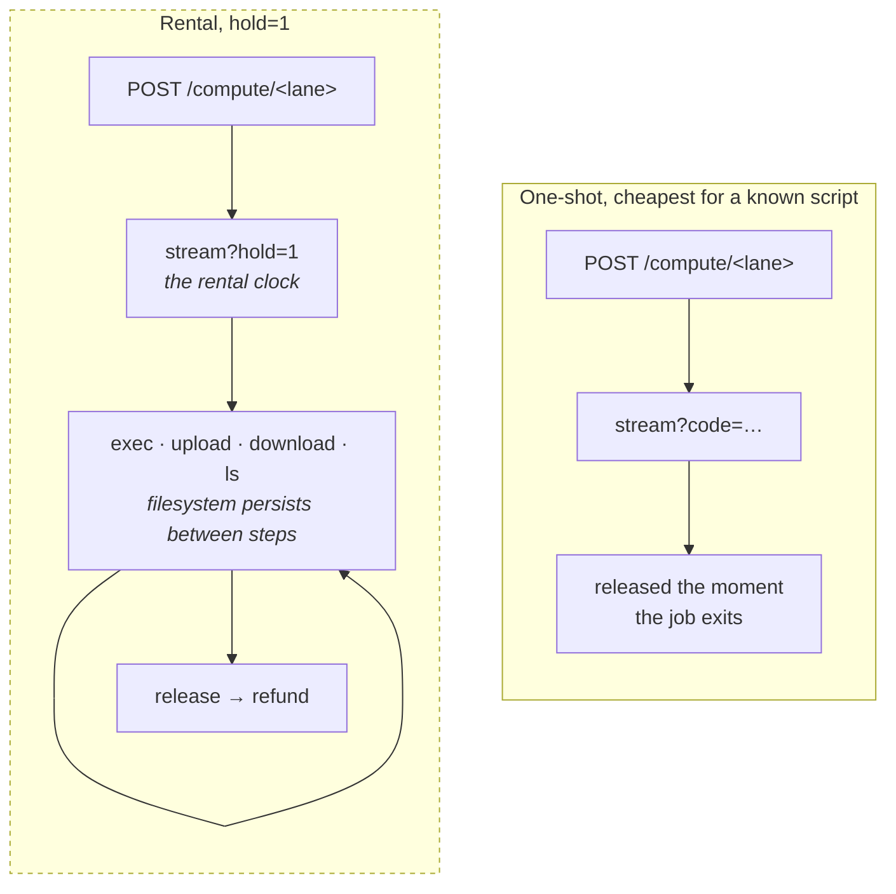
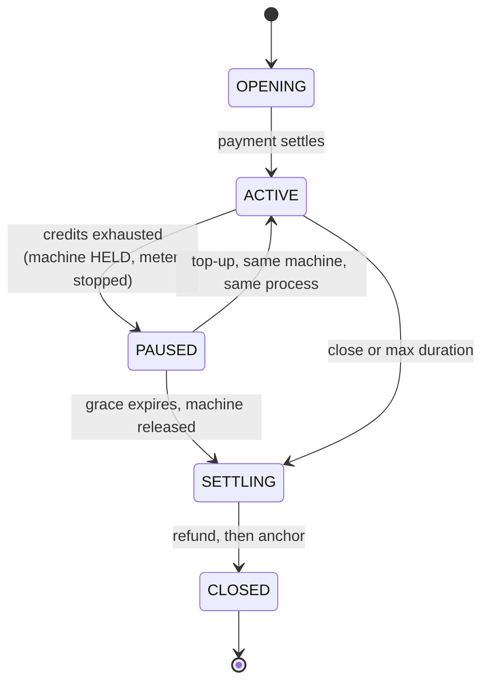
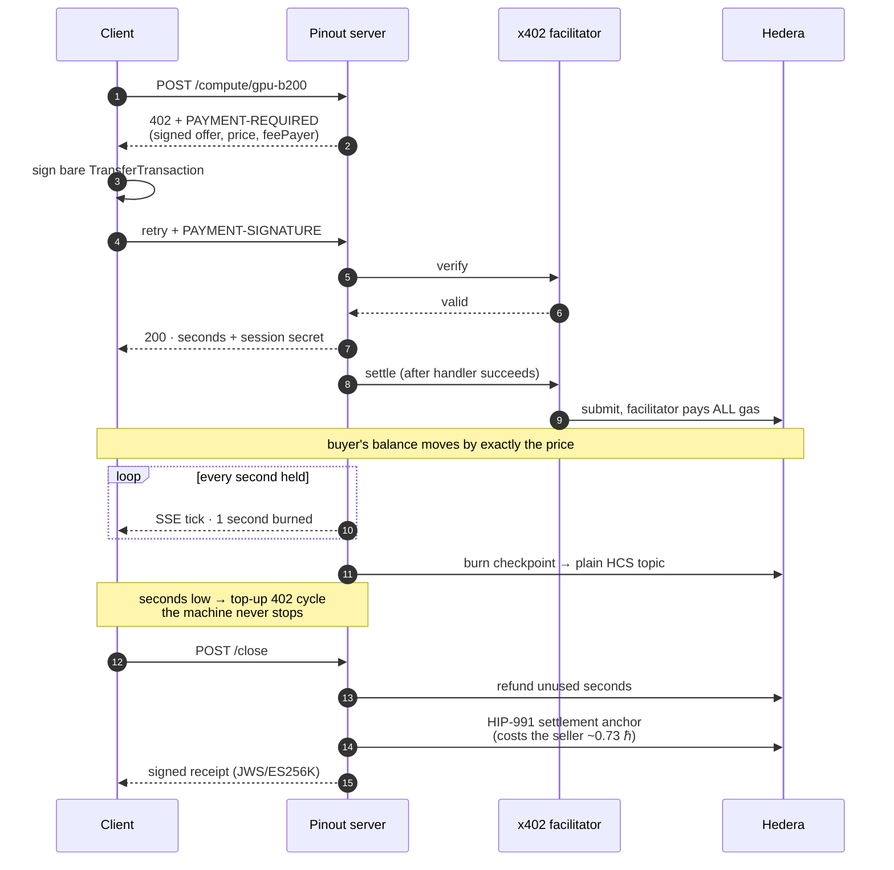
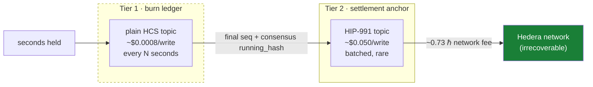
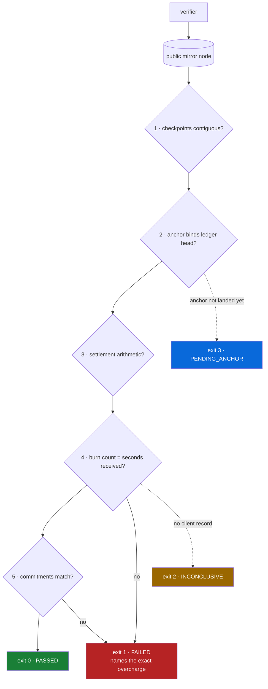

<div align="center">

# Pinout Compute

**Rent a real machine by the second. Pay over [x402](https://x402.org) on [Hedera](https://hedera.com). Get refunded for every second you don't use.**

[](./LICENSE)
[](https://docs.x402.org)
[](https://hashscan.io)
[](https://nodejs.org)

CPU boxes and NVIDIA accelerators from a T4 up to a B300, billed per second held.
One payment buys seconds. Running out pauses the machine instead of killing it, so a
top up resumes the same process where it stopped. Unused seconds are refunded on chain,
and **anyone can recompute the bill from the public ledger**.

</div>

```js
const m = await client.rent("gpu-b200");           // pays over x402, machine comes up
await m.upload("/work/train.csv", data);
await m.exec("import torch; ...");                  // state persists between calls
const model = await m.download("/work/model.pt");   // sha256 checked in transit
await m.release();                                  // unused seconds refunded on chain
```

---

## Table of contents

- [Hardware and pricing](#hardware-and-pricing)
- [What a machine can do](#what-a-machine-can-do)
- [Two shapes of work](#two-shapes-of-work)
- [Running out mid job](#running-out-mid-job)
- [For AI agents](#for-ai-agents)
- [Why this needs a new payment primitive](#why-this-needs-a-new-payment-primitive)
- [How the meter works](#how-the-meter-works)
- [The two tier ledger](#the-two-tier-ledger)
- [Verification](#verification)
- [Guards](#guards)
- [Quickstart](#quickstart)
- [API](#api)
- [Token streams, the other workload](#token-streams-the-other-workload)
- [Why Hedera](#why-hedera)
- [Configuration](#configuration)
- [Status and known limits](#status-and-known-limits)

---

## Hardware and pricing

One credit is one second held. Every line below was verified by provisioning the lane
and reading the device back off the machine itself, so the catalogue cannot advertise
silicon it is unable to deliver.

### Accelerator lanes

| Lane | Accelerator | VRAM | SMs | Compute cap. | vCPU | RAM | tinybar/s | ℏ/hour |
|---|---|---:|---:|:--:|---:|---:|---:|---:|
| `gpu-t4` | Tesla T4 | 15.6 GB | 40 | 7.5 | 2 | 8 GiB | 474,000 | 17.06 |
| `gpu-l4` | NVIDIA L4 | 23.7 GB | 58 | 8.9 | 4 | 16 GiB | 778,000 | 28.01 |
| `gpu-a10` | NVIDIA A10 | 23.7 GB | 72 | 8.6 | 4 | 16 GiB | 912,000 | 32.83 |
| `gpu-l40s` | NVIDIA L40S | 47.7 GB | 142 | 8.9 | 8 | 32 GiB | 1,712,000 | 61.63 |
| `gpu-a100-80` | A100 SXM4 | 85.1 GB | 108 | 8.0 | 8 | 64 GiB | 2,296,000 | 82.66 |
| `gpu-h200` | NVIDIA H200 | 150.1 GB | 132 | 9.0 | 12 | 96 GiB | 3,796,000 | 136.66 |
| `gpu-b200` | NVIDIA B200 | 191.5 GB | 148 | 10.0 | 16 | 128 GiB | 5,149,000 | 185.36 |
| `gpu-b300` | NVIDIA B300 SXM6 | 287.4 GB | 148 | 10.3 | 16 | 192 GiB | 6,209,000 | 223.52 |

### CPU lanes

| Lane | vCPU | RAM | Disk | tinybar/s | ℏ/hour |
|---|---:|---:|---:|---:|---:|
| `cpu-1` | 1 | 1 GiB | 3.2 GiB | 30,000 | 1.08 |
| `cpu-2` | 2 | 4 GiB | 3.2 GiB | 74,000 | 2.66 |
| `cpu-4` | 4 | 8 GiB | 3.2 GiB | 147,000 | 5.29 |

### How the price is set

Every lane uses one formula, so the arithmetic is checkable rather than asserted:

```
price per second = (accelerator + vCPU + RAM + disk cost) x 1.10
```

rounded to the nearest 1,000 tinybar. The 10% is the entire margin. `compute/rates.json`
carries the underlying cost of every lane, so you can divide and check.

A session buys **120 seconds** by default and tops up from there. Session cost is simply
`tinybarPerSecond x 120`, and anything unused comes back at close.

Live and machine readable, including per lane maximum session length:

```bash
curl <host>/lanes
```

> [!NOTE]
> An H100 lane is not listed. It failed to provision on the one occasion it was tried,
> and nothing is advertised here that has not been seen to work. A 40 GB A100 lane is
> not listed either: the same request returned a 40 GB card on one occasion and an 80 GB
> card on another, so it cannot be promised as a distinct guarantee. The 80 GB lane has
> been consistent across every attempt.

---

## What a machine can do

A lane gives you a real Linux container, not a sandboxed expression evaluator.

| | |
|---|---|
| **Runtime** | Python 3.11, CUDA 12.1 and PyTorch 2.4.1 preinstalled on accelerator lanes |
| **Packages** | `pip install` works. Package index and Hugging Face are reachable |
| **Disk** | Read and write anywhere, 3.2 GiB usable on CPU lanes. Files persist for the life of the rental |
| **Files in** | Upload up to 32 MiB per file, binary safe |
| **Files out** | Download any file, checked against its sha256 in transit |
| **Processes** | Full `subprocess`, shell commands, background work |
| **State** | The filesystem persists between `exec` calls in one rental |
| **Session length** | Up to 900 s on CPU lanes, 300 s on accelerator lanes, extendable by topping up |
| **Code size** | 64 KiB per `exec` call, or stage larger payloads as a file |

Two limits worth knowing before you plan a job. Outbound network is filtered rather than
open, so a job that fetches its own input should be tested rather than assumed.
`os.cpu_count()` reports the host's core count, not your lane's quota, so size thread
pools from the lane you bought rather than from what Python reports. The quota itself is
real: a parallel benchmark scores 4.14x higher on `cpu-4` than on `cpu-1`, matching the
4x vCPU ratio you pay for.

---

## Two shapes of work



**One-shot** suits a single known script. Submit it, it runs, the machine is handed back
the moment it exits, and you are billed only for the seconds it actually ran.

**Rental** holds an idle machine so you can work on it. Run code, look at the result,
decide what to do next, put files on it, take artifacts off it. This is what makes the
service usable by an agent, which works by looking at what happened and choosing the
next step.

Verified on both fleets: upload 14,580 B, exec reads it and writes state, a *separate*
exec reads that state back, download a 1 MB artifact with its sha256 checked in transit,
exit codes propagated, money balancing exactly.

---

## Running out mid job

Credits hitting zero does **not** kill the machine. It pauses: the machine is held, the
meter stops, and `SessionWaiting` frames report the grace window draining. Top up and the
*same process* resumes from exactly where it stopped.



Measured on the live deployment: a 150 second job on a 120 second session paused at
124 s, was billed **zero** for 10 s of pause, resumed at **step 120, the step it stopped
on, in the same still running process**, and finished. 180 credits bought, 141 billed,
39 refunded, and the on chain verifier passed all five checks.

---

## For AI agents

Every agent surface is gated on confirmed on chain payment. **No tool returns data before
its payment settles.**

### Tools

| Tool | What it does |
|---|---|
| `rent_machine` | Take a machine and hold it. Returns a session id |
| `exec` | Run Python on it. Filesystem persists between calls |
| `upload_file` | Put a file on it, text or base64 |
| `download_file` | Take a file off it, sha256 checked |
| `list_files` | List a directory |
| `release_machine` | Give it back, stop the meter, get refunded |
| `run_compute` | One-shot: submit a script, get output, machine released |
| `top_up` | Buy more seconds without losing the machine |
| `verify_session` | Recompute your own bill from the public ledger |
| `spend_report` | What you have spent and what budget is left |
| `discover` | Find lanes and prices without being told them |

### How an agent should use this

```
rent_machine({lane: "gpu-l4"})     pick from /lanes by VRAM and price, not by guessing
upload_file(...)                   give it the inputs
exec(...)                          look at the result, decide the next step
download_file(...)                 take the artifact before you release
release_machine(...)               ALWAYS. the meter runs until you do
```

Three things worth telling an agent explicitly:

1. **Release the machine.** The meter runs until it does. Everything on the filesystem is
   gone afterwards, so download first.
2. **Thinking time is billed.** Seconds spent deciding the next step cost the same as
   seconds spent computing. Plan the work before renting, and prefer `run_compute` when
   the job is a single known script.
3. **Pick the lane deliberately.** A `gpu-b300` costs 207x a `cpu-1` per second. Read
   `/lanes` and choose on VRAM and price.

Spend guards (`maxPerCallTinybar`, `budgetTinybar`) reject a challenge **before any
signature exists**, so a mispriced or injected 402 can never put funds at risk.

### MCP server

```bash
npm run mcp
```

### Hedera Agent Kit v4 plugin

```js
import { ToolDiscovery } from "@hashgraph/hedera-agent-kit";
import { pinoutPlugin } from "pinout/agent-kit";

const tools = new ToolDiscovery([pinoutPlugin]).getAllTools(context);
```

Tools extend `BaseTool`, so they participate in v4's **hooks and policies**. Spend limits,
HCS audit hooks and human in the loop confirmation apply automatically, which is exactly
what you want on a payments plugin.

> [!TIP]
> In Agent Kit, a tool's `method` is its **unique registry key**, not an HTTP verb.
> Setting it to `"post"` or `"get"` collides with core tools and the kit silently drops
> yours with `Plugin tool "post" conflicts with core tool`.

### Conversational agent

```bash
node agent/chat.mjs                       # interactive
node agent/chat.mjs -p "rent a GPU and…"  # headless
```

> Given only a URL and a private key, and forbidden from reading this source, an
> independent agent worked out the protocol from the HTTP responses alone and paid. Its
> balance moved by exactly the purchase amount and not one tinybar more. A second agent,
> given no hints, rented a machine, uploaded a dataset, aggregated it, read that result
> back **in a separate step**, downloaded the verdict and released. 86 seconds billed,
> 34 refunded, summing exactly to the 120 bought.

---

## Why this needs a new payment primitive

x402 pays for **one thing, once**. That breaks the moment consumption is continuous. You
cannot sign a payment per second of compute, and you cannot pay upfront because neither
party knows how long the work will run.

This isn't a hypothesis. Hedera's own x402 documentation says so, under
[**Requirements and limitations**](https://docs.hedera.com/solutions/ai/x402):

> Settlement is per-request and discrete. x402 is **not built for streaming payments**
> or multi-hop routing across ledgers.
>
> [Hedera docs, x402](https://docs.hedera.com/solutions/ai/x402)

[x402 issue #2273](https://github.com/x402-foundation/x402/issues/2273) proposes the fix,
`metered-session`, prepaid sessions with auto refund, and has sat **open with zero
comments** since May 2026. Its `unit` enum already contains `second`, and `metered
compute` is named in its use cases.

Pinout implements that proposal, and answers its open questions with measurements.

---

## How the meter works



**Credit is derived from the settled on chain transfer, never from a price table.**
A session can only ever be credited with the amount that actually moved to the seller in
the transaction the buyer signed. This is structural. Three separate money bugs in this
codebase were the same shape, a flat priced 402 plus a credit read from a lane table plus
an on chain refund of the difference, and deriving credit from the transfer makes that
class impossible rather than fixing it three times.

The refund is **not** gated behind the anchor. Gating it meant an anchor failure stranded
a buyer's balance. The anchor is queued and swept instead, and the verifier reports
`PENDING_ANCHOR` (exit 3) rather than accusing an honest seller during the window before
it lands.

---

## The two tier ledger

The original design checkpointed everything to a HIP-991 fee charging topic. Measurement
killed it:

| Payload | Plain HCS topic | HIP-991 topic |
|--------:|----------------:|--------------:|
|   100 B |       $0.00017  |    **$0.0500** |
| 1,000 B |       $0.00078  |    **$0.0500** |
| 4,000 B |       $0.00080  |    **$0.0500** |

A fee charging topic costs a **flat ~$0.050 per message, 62x a plain topic, independent
of payload size *and* of the fee amount.** So the meter is split:



Tier 2 embeds tier 1's final `sequence_number` and consensus `running_hash`, so burn
history cannot be restated without invalidating the anchor that committed to it.

**Both tiers are HCS. There is no smart contract anywhere in this system.**

Anchors are **batched by default**, one anchor covering many sessions. Per session
anchoring costs ~0.73 HBAR against a session priced in thousandths of that, which turns
abandonment into a drain. `?settlement=priority` buys a dedicated anchor, but only when
the session's own revenue covers its cost. Otherwise it falls back to batched, because
unconditional priority is a free way to make a stranger spend 0.73 HBAR per call.

---

## Verification

The verifier trusts **only** the free public mirror node and the buyer's own record of
seconds received. No API key, nothing to trust.

```bash
npm run verify -- <sessionId>
```



One implementation, shared by the CLI, the MCP tool and the Agent Kit plugin. The
artifact whose entire job is to be trustworthy should not exist twice and disagree with
itself.

### Watch it catch a cheating seller

```bash
npm run e2e -- --cheat 400        # seller inflates the ledger
npm run verify -- <sessionId>     # exits 1
```

```
1. contiguity              PASS
2. tier binding            PASS
3. settlement arithmetic   PASS
4. ledger vs received      FAIL  claims 3000, client received 2600
                                 (+400 phantom = 80000 tinybar overcharge)
5. checkpoint commitments  FAIL  11/11 do not match
```

### Trust boundary

Pinout claims a **tamper evident, independently recomputable consumption ledger**. It does
**not** claim trustless delivery proof.

Under `--cheat`, checks 1 to 3 still pass. The ledger genuinely is immutable and
internally consistent, which is what HCS guarantees and all it guarantees. Only comparing
it against the buyer's own record exposes fabrication. A seller that fabricates events
*and* whose client never notices is outside what this proves.

`INCONCLUSIVE` exists for exactly that reason. Without a client record, the verifier
refuses to say "passed".

---

## Guards

Testnet HBAR is free from a faucet, so **the payment gate provides no economic friction on
testnet**. Payment alone cannot be what stands between a stranger and a real GPU bill.
Admission is decided *before* the 402 is issued, on the principle that you never quote a
price for work you will not do:

- concurrency caps, sessions and accelerator sessions counted separately
- per lane wall clock ceilings
- capacity budget ceilings, charged in seconds **held** rather than seconds billed, with
  an accelerator reserve held back
- **seller solvency**, refusing new sessions when the seller could not afford a settlement
  anchor for every open session, rather than risk stranding a prepaid balance
- an orphan reaper across every fleet, because a forgotten accelerator bills in silence

---

## Quickstart

```bash
git clone https://github.com/hitakshiA/pinout.git
cd pinout && npm install
cp .env.example .env        # fill in accounts, or use real env vars
npm run check-config
```

You need two funded Hedera **testnet** accounts with **ECDSA (secp256k1)** keys. Get one
from [portal.hedera.com](https://portal.hedera.com), then:

```bash
node scripts/new-role-account.mjs SELLER 60   # creates and funds the seller
```

Run the full flow. Every on chain step prints a HashScan link:

```bash
npm run compute-e2e             # rent a real machine, run code, get refunded
npm run e2e                     # metered token stream, end to end
npm run verify -- <sessionId>   # recompute the bill from the mirror node
```

---

## API

### Buying

| Method | Route | Paid | Purpose |
|---|---|:--:|---|
| `POST` | `/compute/<lane>` | ✅ | Buy seconds on a lane. Price committed in the 402 |
| `POST` | `/topup/<lane>/<id>` | ✅ | Add seconds without losing the machine |
| `POST` | `/session` | ✅ | Open a token billed session |
| `POST` | `/session/<id>/topup` | ✅ | Add credits to a token session |

### Using

| Method | Route | Auth | Purpose |
|---|---|:--:|---|
| `GET` | `/session/<id>/stream` | 🔑 | SSE meter. `?provider=compute`, `?hold=1` to rent, `?n=` seconds cap |
| `POST` | `/session/<id>/exec` | 🔑 | Run code on a machine you are holding |
| `POST` | `/session/<id>/files` | 🔑 | Put a file on the machine |
| `GET` | `/session/<id>/files?path=` | 🔑 | Take a file off, with sha256 |
| `GET` | `/session/<id>/files?dir=` | 🔑 | List a directory |
| `POST` | `/session/<id>/code` | 🔑 | Stage code larger than a query string |
| `POST` | `/session/<id>/close` | 🔑 | Refund, then anchor, then signed receipt |
| `GET` | `/session/<id>` | 🔑 | Session status |

🔑 = `Authorization: Bearer <sessionSecret>`, issued once at mint.

`exec` and the file routes are **not separately priced**. They act on a machine already
billed by the second, and they refuse with `402` at zero credits, because a paused session
would otherwise be free compute.

### Discovery

| Method | Route | Purpose |
|---|---|---|
| `GET` | `/lanes` | Every lane, its hardware, its price, and how to buy it |
| `GET` | `/health` | Liveness, capacity, whether each class of lane is sellable |
| `GET` | `/` | Service descriptor, live pricing, topic links |
| `GET` | `/bazaar`, `/.well-known/x402` | x402 catalog for agents |

---

## Token streams, the other workload

The same meter runs token billed sessions, which is where the design started. One payment
buys credits, an SSE stream burns one per event, the client tops up mid stream without
dropping the connection, and unused credits are refunded on chain. Compute reuses this
pipeline unchanged, with one tick per second instead of one per token.

```bash
npm run e2e
```

---

## Why Hedera

| Property | What it buys |
|---|---|
| **Fee payer model** | The facilitator pays all network fees. The buyer needs **no fee headroom**, so it can hold exactly the purchase amount and transact. |
| **HIP-991 topic fees** | A log that **costs money to write**, ~0.7345 HBAR per settlement anchor in irrecoverable network fees, so publishing your final numbers is expensive and over reporting is expensive. No EVM chain charges for a log write without deploying a contract. The topic's custom fee goes to a collector fixed at topic creation, **not** to the paying buyer. |
| **HCS `running_hash`** | The audit chain is computed by consensus nodes, not by the party being audited. |
| **Free mirror node** | Public, unauthenticated, no signup, so verification costs the buyer nothing. |

---

## Configuration

| Variable | Default | Meaning |
|---|---|---|
| `HEDERA_ACCOUNT_ID`, `HEDERA_PRIVATE_KEY` | | Buyer and payer. On this deployment it is *also* the fixed HIP-991 fee collector, a test artifact rather than a design property. A third party buyer never receives that fee. |
| `SELLER_ACCOUNT_ID`, `SELLER_PRIVATE_KEY` | | Seller. Owns both topics |
| `BURN_TOPIC_ID` | | Tier 1, plain HCS |
| `TOPIC_ID` | | Tier 2, HIP-991 |
| `ALLOW_GPU` | `false` | Accelerator lanes are off unless explicitly enabled |
| `MAX_CONCURRENT_SESSIONS`, `MAX_CONCURRENT_GPU` | `8`, `1` | Capacity caps |
| `MAX_SECONDS_CPU`, `MAX_SECONDS_GPU` | `900`, `300` | Wall clock ceiling per session |
| `EXHAUSTION_GRACE_MS` | `90000` | How long a machine is held, unbilled, awaiting top up |
| `MAX_CODE_BYTES`, `MAX_FILE_BYTES` | 64 KiB, 32 MiB | Upload limits |
| `PRICE_PER_EVENT_TINYBAR` | `200` | Unit price for token lanes |
| `CHECKPOINT_EVERY` | `250` | Units per burn checkpoint |
| `MAX_SESSION_DURATION_MS` | `600000` | Idle timeout before auto settle |
| `FACILITATOR` | `x402` | `x402` or `blocky402` |

`process.env` overrides `.env`, and `.env` is optional.

> [!WARNING]
> **ECDSA (secp256k1) keys only.** An ED25519 key fails *silently* in EVM adjacent
> tooling. `viem` accepts any 32 byte hex and derives the wrong identity, surfacing as a
> confusing "signature mismatch".

> [!NOTE]
> Accounts auto created via EVM alias are **hollow** (`key: null`) until they sign
> something, which breaks the facilitator's `AccountInfoQuery` check. Use
> `scripts/hydrate-key.mjs`, or create accounts with `AccountCreateTransaction`.

---

## Built on

[`@x402/core`](https://www.npmjs.com/package/@x402/core) ·
[`@x402/hedera`](https://www.npmjs.com/package/@x402/hedera) (exact client **and** server) ·
[`@x402/hono`](https://www.npmjs.com/package/@x402/hono) ·
[`@hiero-ledger/sdk`](https://www.npmjs.com/package/@hiero-ledger/sdk) ·
[`@hashgraph/hedera-agent-kit`](https://www.npmjs.com/package/@hashgraph/hedera-agent-kit) ·
[`@modelcontextprotocol/sdk`](https://www.npmjs.com/package/@modelcontextprotocol/sdk)

Implements the x402 [`metered-session`](https://github.com/x402-foundation/x402/issues/2273),
[`offer-and-receipt`](https://github.com/x402-foundation/x402/blob/main/specs/extensions/extension-offer-and-receipt.md)
(JWS/ES256K profile) and [`bazaar`](https://github.com/x402-foundation/x402/blob/main/specs/extensions/bazaar.md) extensions.

---

## Status and known limits

Working end to end on Hedera testnet, deployed on Azure, exercised against real machines.
Stated plainly:

- **Testnet only.**
- **Unit economics do not close at demo scale.** A settlement anchor costs ~0.73 HBAR
  while a `cpu-1` session sells for 0.036 HBAR. Batching amortises it, with break even
  around 2,450 billed seconds per anchor, but the seller subsidises small and abandoned
  sessions today.
- **Cold start is absorbed by the seller.** The buyer's meter starts after provisioning. A
  first pull of a 3 GB accelerator image measured 101,176 ms. Once cached, 187 ms. Pre
  warm before opening an accelerator lane publicly.
- **You pay for thinking time when renting.** An agent deliberating between steps is
  billed for those seconds. `run_compute` is cheaper for a single known script.
- **Outbound network is filtered**, so a job that fetches its own input should be tested
  rather than assumed. `os.cpu_count()` reports the host's cores, not the lane's quota.
- **Accelerator capacity is not guaranteed.** Lanes are sold from a shared fleet. An H100
  lane is not offered because it failed the one time it was tried, and a 40 GB A100 lane
  is not offered because the same request returned different silicon on different
  occasions.
- Sessions are single node and held in memory, persisted to an append only log. A crash
  loses at most `CHECKPOINT_EVERY` units, and **the loss falls on the seller**.
- Facilitator equivalence rests on one trial each, not a load test.

## License

[MIT](./LICENSE) © Hitakshi Arora
