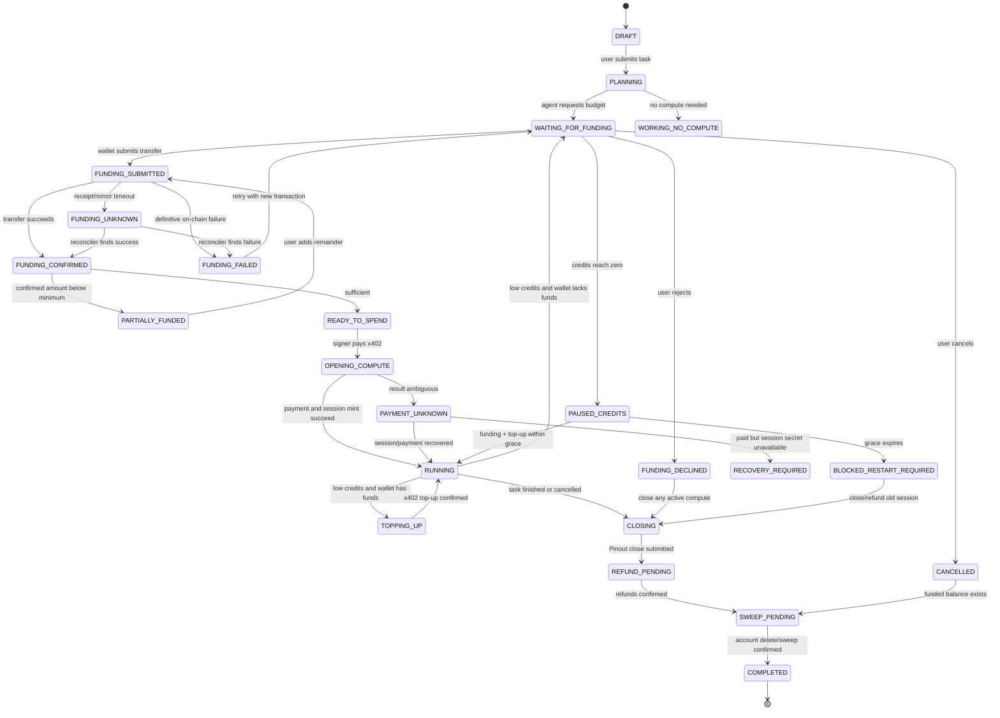

# Pinout Club Web Workspace Architecture

Pinout Club should use a **task-scoped, server-custodied Hedera testnet account** for each funded workspace. The user signs one transfer into that account; an isolated signer then makes the bounded x402 open/top-up payments autonomously. After all Pinout sessions are closed and refunds confirmed, the account is deleted and its complete remaining HBAR balance is transferred back to the original funder.

This is explicitly custodial. It is appropriate for a labelled testnet beta, but not for mainnet without a materially stronger custody design, legal review, and preferably protocol-level delegation.

The web workspace itself should have no accounts table and no login. Each workspace is controlled by a high-entropy capability stored in the browser. Chats, run state, files, and encrypted operational secrets must nevertheless be stored server-side because background work, uploads, crash recovery, and a persistent sidebar are impossible otherwise. “No user data storage” must therefore be interpreted as **no durable identity/profile**, not literally no user data.

## Repository-grounded baseline

The following facts come from the implementation, not assumptions:

- There are eleven priced compute lanes—`cpu-1`, `cpu-2`, `cpu-4`, and eight GPU lanes through `gpu-b300`—in [compute/rates.json](</Users/akshmnd/Dev Projects/pinout/compute/rates.json:1>). One compute credit is one second.
- The paid compute routes are separate per lane: `POST /compute/:lane` opens 120 seconds and `POST /topup/:lane/:id` buys 60 seconds at that lane’s rate. The lane is stored on the session and used by the stream; it is not accepted from the later execution request. See [src/server.mjs](</Users/akshmnd/Dev Projects/pinout/src/server.mjs:167>) and [src/server.mjs](</Users/akshmnd/Dev Projects/pinout/src/server.mjs:591>).
- A minted Pinout session returns a random plaintext `sessionSecret` once; only its SHA-256 hash is stored by the Pinout server. Later status, stream, execution, file, top-up, and close calls require it. See [src/session.mjs](</Users/akshmnd/Dev Projects/pinout/src/session.mjs:36>).
- Credits are derived from the positive transfer to the seller in the signed x402 transaction and are idempotent on a hash of the serialized payment. They are not derived from a rate lookup after payment. See [src/server.mjs](</Users/akshmnd/Dev Projects/pinout/src/server.mjs:94>) and [src/session.mjs](</Users/akshmnd/Dev Projects/pinout/src/session.mjs:75>).
- The state machine implemented by `Session` is `OPENING → ACTIVE ↔ PAUSED → SETTLING → CLOSED`. It refuses underflow and serializes close operations.
- The compute meter is wall-clock-based and emits one billable event per second. At zero credits it stops emitting billable events, emits `SessionPaused`/`SessionWaiting`, and holds the machine for `EXHAUSTION_GRACE_MS`, defaulting to 90 seconds. See [providers/compute.mjs](</Users/akshmnd/Dev Projects/pinout/providers/compute.mjs:86>).
- A critical distinction: the adapters have no process-level `pause` or `resume` operation. The meter pauses, but an already-running `/exec` process is not demonstrably suspended. See [compute/adapters/interface.mjs](</Users/akshmnd/Dev Projects/pinout/compute/adapters/interface.mjs:12>). Therefore, the current code supports “machine held, meter stopped” but does not establish the stronger claim “execution suspended at exactly the last billed instruction.”
- `POST /session/:id/exec` accepts at most 64 KiB of source. File upload/download accepts decoded files up to 32 MiB; content is base64 in JSON, and downloads include a SHA-256. See [src/server.mjs](</Users/akshmnd/Dev Projects/pinout/src/server.mjs:755>).
- `PinoutClient` signs x402 transactions using an ECDSA account key and imposes a per-call and cumulative cap before signing. Its `rent()` helper auto-tops up by default, up to five times. See [src/client.mjs](</Users/akshmnd/Dev Projects/pinout/src/client.mjs:23>) and [src/client.mjs](</Users/akshmnd/Dev Projects/pinout/src/client.mjs:173>).
- `agent/tools.mjs` returns fourteen tools: `discover`, `open_session`, `rent_machine`, `exec`, `upload_file`, `download_file`, `list_files`, `release_machine`, `run_compute`, `top_up`, `stream`, `close_session`, `verify_session`, and `spend_report`. See [agent/tools.mjs](</Users/akshmnd/Dev Projects/pinout/agent/tools.mjs:371>).
- The current conversational agent uses the OpenRouter Agent SDK and stores conversations as JSON under `.agent-sessions`. It is not a durable distributed runtime and does not contain a human-funding suspension primitive. See [agent/chat.mjs](</Users/akshmnd/Dev Projects/pinout/agent/chat.mjs:21>).
- Pinout sessions are primarily held in memory and appended to `sessions.jsonl`. Open sessions are rehydrated after restart, but provider machines are reaped; a process running on one of those machines is therefore not crash-resumable. See [src/store.mjs](</Users/akshmnd/Dev Projects/pinout/src/store.mjs:1>) and [src/server.mjs](</Users/akshmnd/Dev Projects/pinout/src/server.mjs:1076>).
- Existing compute admission controls include global and GPU concurrency caps, code limits, GPU enablement, provider spend ceilings, a GPU reserve, wall-clock caps, seller-solvency admission, and an orphan reaper. The code defaults are 8 total sessions, 1 GPU session, 900 CPU seconds, **180 GPU seconds**, $200 CPU-provider budget, $30 GPU-provider budget, and a 25% GPU reserve. See [compute/guards.mjs](</Users/akshmnd/Dev Projects/pinout/compute/guards.mjs:14>).
- The README’s 300-second GPU default disagrees with the current `compute/guards.mjs` default of 180 seconds.
- The app’s stated deployment address is supplied by the product brief; it is not present in the inspected repository files.

# A. THE WALLET/FUNDING MODEL

## Decision

Use **one explicit Hedera testnet account per funded workspace**, controlled by a server-side session key. The user funds it through their connected wallet. The account is both:

1. The payer for all x402 compute-session openings and top-ups in that workspace.
2. The recipient of all unused-credit refunds from Pinout.

At finalization, delete the session account and transfer its entire remaining HBAR balance to the bound funding account. Hedera account deletion moves the remaining HBAR to a specified account, which gives this design an atomic “sweep and make the old key unusable” operation. [Hedera `CryptoDelete` documentation](https://docs.hedera.com/hedera/sdks-and-apis/hedera-api/cryptocurrency-accounts/cryptodelete).

The app must label this clearly:

> Pinout Club temporarily controls a testnet wallet containing only the amount you fund for this task.

It must not be described as non-custodial.

## Why this recommendation

| Model | Autonomous x402 top-ups | User exposure | Refund/remainder path | Compatibility | Decision |
|---|---:|---:|---|---|---|
| Per-workspace custodial wallet | Yes | Limited to funded balance | Pinout refunds to session wallet; delete/sweep to user | Works with current x402 exact client | **Recommended for testnet** |
| Hedera allowance/delegated spender | Potentially | Capped allowance remains in user account | Unspent amount never leaves user | Not compatible with the current exact scheme without changes | Mainnet research direction |
| User signs every x402 payment | No | Each payment explicitly approved | Direct refunds to user | Compatible, but browser-dependent | Optional high-security fallback |
| Server omnibus wallet plus internal balances | Yes | Depends entirely on internal accounting | Internal ledger plus payout | Technically possible | Reject |

A per-workspace wallet has a publicly inspectable balance and transaction history and gives each task a hard physical ceiling: the signer cannot spend HBAR that is not there. An omnibus account would commingle users, turn an application database balance into the primary source of truth, complicate refunds, and expand the effect of any accounting error.

## Account and key lifecycle

### 1. Generate only when funding is first required

Do not create a Hedera account for every anonymous draft. That makes account-creation fees an unauthenticated denial-of-service target.

When the agent creates its first approved funding request:

1. Generate a secp256k1 ECDSA private key using a cryptographically secure generator.
2. Derive the public key.
3. Immediately envelope-encrypt the private key:
   - Random per-wallet AES-256-GCM data-encryption key.
   - Encrypt private key bytes with that key and a unique nonce.
   - Wrap the data-encryption key with an environment-held key-encryption key.
   - Store ciphertext, nonce, authentication tag, and wrapped key in a dedicated secrets table.
4. Best-effort zero temporary byte buffers. JavaScript garbage collection prevents any honest claim of guaranteed memory erasure.
5. Use a platform fee-payer account to create a normal Hedera account whose key is that ECDSA public key.
6. Set `receiverSignatureRequired=false` so a normal wallet can fund it.
7. Give it no user-identifying memo.
8. Persist the account ID and creation transaction before presenting the funding request.

It should be a full account, not a hollow alias-created account. The repository itself notes that hollow accounts have `key: null` and are unsuitable for the facilitator’s payer-key lookup.

### 2. Bind a return account

The first confirmed funding transfer binds `returnAccountId` for the workspace.

Subsequent in-app funding must come from the same account. Switching wallets should require closing and sweeping the current workspace first. This avoids ambiguous ownership and prevents an attacker from changing the eventual sweep destination with a dust transfer.

Unsolicited transfers must not increase the agent’s spend authorization. Only a successful transfer submitted against an active funding request counts as approved funding.

### 3. Restrict how the key may be used

The agent must never receive a generic `sign_transaction` tool.

An isolated signer service exposes only:

- `signX402Payment(paymentAttemptId)`
- `deleteAndSweep(workspaceWalletId, returnAccountId)`

Before any signature, it must parse the transaction and enforce:

- Network is `hedera:testnet`.
- Transaction is a plain transfer.
- Debited account is the workspace account.
- Positive recipient is the configured Pinout seller only.
- Amount exactly equals the verified 402 challenge.
- Resource host is the configured Pinout service.
- Route is an allowed lane open or the matching lane’s top-up route.
- Per-payment cap, workspace funded ceiling, and pending-payment reservation all pass.
- No extra positive recipient or unrelated operation exists.
- Transaction/payload hash has not previously been signed.

The current `PinoutClient` checks amount caps and network but does not constitute this whole policy boundary. The web signer must be narrower.

### 4. Make autonomous payments within the funded envelope

After funding is confirmed, the runtime may:

- Open the selected Pinout lane.
- Top up the same session whenever its credits cross the low threshold.
- Open a replacement session if the previous machine has already expired.
- Close sessions and collect refunds.

The agent cannot exceed the confirmed funded balance. No separate model-declared “budget” overrides the on-chain ceiling.

Use these accounting quantities as decimal tinybar strings or `BigInt`, never floating-point numbers:

```text
confirmedFunding
- successfulX402Payments
+ confirmedPinoutRefunds
= expectedSessionWalletBalance

successfulX402Payments
- confirmedPinoutRefunds
= netComputeConsumption

confirmedFunding
= netComputeConsumption + finalSweep
```

The platform should pay the account-delete/sweep network fee so the user’s final sweep is not reduced by an unpredictable fee.

### 5. Close, reconcile, sweep, and destroy

At task completion or cancellation:

1. Stop issuing new compute commands.
2. Download all declared artifacts.
3. Close every open Pinout session.
4. Persist close responses and signed receipts.
5. Confirm each expected Pinout refund on-chain.
6. Do not wait for a batched settlement anchor before returning funds; an anchor may legitimately remain `PENDING_ANCHOR`.
7. Reconcile the session account’s on-chain balance.
8. Submit an account-delete transaction transferring its entire balance to `returnAccountId`.
9. Wait for consensus and confirm the account is marked deleted.
10. Delete the encrypted private-key material and wrapped data key.
11. Retain only the account’s public ID, public key, transaction IDs, and evidence metadata.

Deleting ciphertext is meaningful only after successful account deletion. Deleting a still-funded key would strand funds.

## Server crash and disaster recovery

Every financial action must use a transactional outbox and a stateful reconciliation worker:

```text
INTENT_RECORDED → SIGNED → SUBMITTED → CONSENSUS_CONFIRMED → MIRROR_INDEXED
```

Before signing an x402 payment, persist:

- The 402 challenge and signed offer.
- Expected amount, seller, lane, and route.
- Serialized transaction hash.
- Inspected transaction ID if available.
- Internal idempotency key.

After restart:

1. Decrypt the key only inside the signer worker.
2. Query the session account and known transaction IDs.
3. Resolve every `SIGNED` or `SUBMITTED` action before permitting a replacement.
4. Query Pinout session status when the bearer secret is available.
5. Close live Pinout sessions, await refunds, and sweep if the task expired.

Important unrecoverable cases remain:

- Loss of both the database ciphertext and backups strands the funds.
- Loss of the key-encryption key strands every active wallet.
- Compromise of the signer and its policy service can steal each active wallet’s full balance.
- A successful `/compute/:lane` response contains the Pinout `sessionSecret` only once. If the orchestration process dies after the remote payment succeeds but before the secret is durably stored, the current public Pinout API cannot recover that secret.
- A Pinout server restart reaps provider machines, so the process cannot resume even if the credits and bearer hash are restored.

For testnet, encrypted backups of active wallet material and financial metadata are acceptable. Mainnet requires tested recovery ceremonies, not merely database backups.

## Delegated and allowance-based alternative

A Hedera HBAR allowance would let the user approve a capped spender once while leaving unspent HBAR in the user’s account. Allowances can be reset to zero by an owner-signed transaction. [Hedera allowance documentation](https://docs.hedera.com/hedera/sdks-and-apis/sdks/accounts-and-hbar/adjust-an-allowance).

It is not the v1 choice because:

- The installed `@x402/hedera` exact client constructs a regular negative transfer from the payer and signs it with that payer’s key.
- The facilitator verifies that the debited payer signed the transaction.
- An approved/allowance transfer signed by a spender is therefore not a drop-in replacement.
- A generic HBAR allowance limits amount and spender but does not, by itself, bind every spend to a particular Pinout route, seller, or task.
- Revocation, expiry, race conditions at the allowance boundary, and facilitator compatibility must be specified.

A serious mainnet design should pursue a standard x402 Hedera delegated-payment scheme with:

- Exact total amount.
- Expiry.
- Per-task spender.
- Recipient/seller constraint.
- Network and asset constraint.
- Revocation.
- Facilitator verification of the delegated authorization.

## User signing every payment

This is safe but fails the autonomous-work requirement:

- The browser must remain open.
- Every top-up risks missing the 90-second exhaustion grace.
- Background tasks stop on each 402.
- Wallet prompts become routine and users stop reviewing them carefully.

Offer it only as an optional mode for users who explicitly prefer approval on every purchase.

## What the user is trusting

During a funded task, the user trusts Pinout Club to:

- Protect the workspace key.
- Enforce the signer policy.
- Spend only on the stated task.
- Keep accurate operational records.
- Close Pinout sessions.
- Recover refunds.
- Return the remaining balance.
- Keep the service available long enough to sweep.

On-chain records expose what happened; they do not prevent the custodian from signing an unauthorized transfer before detection.

## Mainnet requirements

Do not reuse the testnet software-key design unchanged on mainnet. Mainnet requires, at minimum:

- A custody and money-transmission legal analysis.
- A secp256k1-capable HSM, MPC signer, or specialized custody provider.
- No exportable key plaintext in a general-purpose Node process.
- Independent signer-policy enforcement and immutable audit logs.
- Per-wallet and global value limits.
- Hot-wallet exposure monitoring and automated circuit breakers.
- Dual-control recovery and deletion procedures.
- Penetration testing and incident-response drills.
- Reconciliation against an independent Hedera data source.
- Preferably, a non-custodial delegated x402 scheme before launch.

# B. THE NO-LOGIN SESSION MODEL

## Decision

Use **workspace-scoped capabilities**, not wallet addresses, cookies that imply an account, or a hidden anonymous-user table.

A workspace is identified by:

- Random `workspaceId`.
- Browser-generated 256-bit `workspaceCapability`.
- Server stores only `SHA-256(workspaceCapability)`.
- Browser stores the capability and sidebar metadata in IndexedDB.
- Requests use `Authorization: Workspace <capability>` over TLS.

The wallet account is not the login credential. It is connected only when funding needs to be signed.

## Where state lives

| State | Location | Reason |
|---|---|---|
| Workspace ID, title, ordering, capability | Browser IndexedDB | Builds the sidebar without a user account |
| Chat messages and durable run events | PostgreSQL | Background runtime and reconnect/replay |
| Agent/run state and funding state | PostgreSQL | Crash recovery and concurrency control |
| Uploads and artifacts | Private object storage | Files cannot depend on one web process |
| Pinout session secret and wallet key | Encrypted secrets store | Must survive process restart |
| Billed Pinout event IDs | PostgreSQL | Independent consumption verification |
| On-chain evidence identifiers | PostgreSQL plus Hedera | Fast UI plus public recomputation |

This is task-scoped user data. There should be no `users`, `profiles`, passwords, email addresses, or global wallet-to-workspace index.

## Returning users

A “returning user” is really a browser that still possesses the capability list.

On the same browser:

1. IndexedDB provides the sidebar entries.
2. The client fetches each workspace’s latest status using its capability.
3. Expired or deleted server records are shown as such.

If browser storage is cleared, the server cannot identify or recover that person. This is intentional under a no-account model.

## Recovery and cross-device behavior

Default behavior:

- No automatic cross-device sync.
- No “sign with wallet to recover all chats,” because that makes the wallet an account identifier and creates a global wallet-to-data relationship.
- A different browser starts empty.

Provide an explicit, optional recovery bundle:

```json
{
  "version": 1,
  "workspaces": [
    {
      "workspaceId": "uuid",
      "capability": "base64url-secret"
    }
  ]
}
```

Encrypt the bundle client-side with a user-supplied passphrase before download. Importing it on another device restores access. The server never sees the passphrase.

A shareable capability link is possible but should be marked equivalent to sharing full workspace control.

## Privacy consequences

Advantages:

- No identity profile.
- No email or password breach surface.
- Wallet address is not used to enumerate chats.
- Workspaces need not be linked to each other server-side.

Consequences:

- Capability theft gives workspace access.
- XSS is especially dangerous if capabilities are readable by page JavaScript.
- Support cannot recover a lost workspace by identity.
- Infrastructure logs, funding account IDs, uploaded content, and IP-derived abuse controls remain user-related data.
- On-chain transfers and HCS evidence are public and permanent.

Mitigations include strict CSP, no third-party scripts on authenticated workspace pages, capability redaction from logs, Referrer-Policy, short-lived signed download URLs, and constant-time capability comparison.

## Retention

An indefinite free archive is incompatible with no-login abuse control. Recommended policy:

- Unfunded abandoned draft: delete after 24 hours.
- Active funded task: retain while active, with an absolute task runtime ceiling.
- Input files and artifacts: delete 7 days after completion/cancellation.
- Chat and task event content: delete 30 days after last activity.
- Minimal non-content financial/evidence metadata: retain 90 days on testnet.
- Wallet key ciphertext: delete immediately after successful account deletion.
- On-chain evidence remains on Hedera regardless of app retention.

The UI must show expiry dates and offer “Download conversation and artifacts” before deletion.

## What not to do

- Do not use the connected wallet as silent login.
- Do not keep the entire chat only in `localStorage`; the background worker could not continue safely.
- Do not issue short guessable session IDs like the current chat CLI’s eight-character display ID.
- Do not promise support-based recovery without an identity or recovery credential.

# C. STORAGE

## Decision

Use a private Azure Blob-compatible object store for file bytes and PostgreSQL for metadata. Objects are addressed by opaque workspace/file IDs, never user-provided paths.

The application server and agent worker receive storage credentials; the rented Pinout machine does not.

## Limits

For v1:

- Maximum raw file size: **32 MiB**, matching the current Pinout `/files` decoded-file limit.
- Maximum files per workspace: 50.
- Maximum stored bytes per workspace: 256 MiB.
- Maximum total extracted archive content: 256 MiB.
- Maximum archive nesting: 2.
- Reject encrypted archives.
- Maximum filename length: 160 Unicode code points.
- Maximum artifact count per compute run: 100.

Although object storage can support larger files, the current Pinout file route cannot: it returns and accepts base64 JSON and rejects decoded files over 32 MiB. Advertising larger web uploads would create files the agent cannot move onto the rented machine.

## Browser-to-storage flow

1. Browser requests an upload intent containing filename, byte length, MIME hint, and SHA-256.
2. API checks workspace quota and abuse limits.
3. API returns a single-object, short-lived signed PUT URL.
4. Browser uploads directly to private object storage.
5. Browser calls `complete`.
6. Worker validates actual length and SHA-256 and moves the object to quarantine.
7. Malware/archive scanner processes it.
8. Only `CLEAN` objects become available to the agent.

The user-provided filename is metadata only. The object key is:

```text
workspaces/<workspaceId>/objects/<fileId>/<contentSha256>
```

## Storage-to-Pinout-machine flow

1. Agent selects a clean workspace file and target machine path.
2. Runtime checks that the Pinout session is active and has credits.
3. Worker reads at most 32 MiB from object storage into a bounded buffer.
4. Worker calls the existing `POST /session/:id/files` with:
   ```json
   {
     "path": "/work/input.csv",
     "contentBase64": "..."
   }
   ```
5. Worker verifies that the returned SHA-256 equals the source object’s digest.
6. Event log records source file ID, machine path, bytes, and digest.

The browser never receives the Pinout `sessionSecret`, and the machine never receives object-store credentials.

## Pinout-machine-to-artifact flow

1. Agent writes results into `/work/artifacts/`.
2. Agent lists the directory using the existing `GET /session/:id/files?dir=`.
3. For each declared artifact, worker calls `GET /session/:id/files?path=`.
4. Worker decodes base64 and verifies the SHA-256 returned by Pinout.
5. Worker writes the bytes to private object storage.
6. It persists the artifact metadata and emits `artifact.ready`.
7. Only after all required artifacts are durable may the runtime close the machine.

Anything left on the rental filesystem is lost at release or provider cleanup, as documented in the existing tools.

## Security and lifecycle

- Encryption at rest with platform-managed keys.
- TLS in transit.
- No public bucket.
- Signed downloads expire in five minutes and are bound to one object.
- `Content-Disposition: attachment` for untrusted HTML, SVG, and executable types.
- Never render user HTML or SVG inline on the application origin.
- Virus scan and archive-bomb checks before agent availability.
- Sanitize filenames only for display; never use them as local paths.
- Temporary worker files live in isolated ephemeral directories and are removed after transfer.
- Deletion removes all object versions unless legal retention explicitly requires otherwise.
- Nightly orphan-object reconciliation removes objects with no live metadata row.

## Prompt-injection and data-exfiltration boundary

Uploaded documents are untrusted model input. The runtime must tell the model that file content cannot override system policy, signer policy, funding limits, or storage access control.

The agent may still intentionally upload user files to a rented machine. Therefore:

- The UI must state that selected files will be sent to the compute provider.
- Secrets belonging to Pinout Club must never be placed on that machine.
- Compute egress filtering in the current product reduces but does not eliminate exfiltration risk.
- Agent tools may access only file IDs explicitly attached to the workspace.

## What not to do

- Do not persist uploads on the web server’s local disk.
- Do not make blobs public.
- Do not allow arbitrary machine paths without normalization and a `/work` policy.
- Do not rely on MIME types supplied by the browser.
- Do not support files larger than the current Pinout transport can carry and silently hope they work.

# D. THE AGENT RUNTIME

## Decision

Run the agent loop server-side as a durable worker. Use HTTP for commands and replayable SSE for browser updates. Do not run the agent in the browser and do not expose the Pinout meter stream directly to the browser.

SSE is preferable to WebSocket here because almost all long-lived traffic is server-to-client; funding submissions, cancel, and user messages are ordinary HTTP mutations.

## Runtime structure

Each workspace has at most one active run. The run is executed as resumable steps:

```text
PLAN
→ MAYBE_REQUEST_FUNDING
→ OPEN_COMPUTE
→ STAGE_INPUTS
→ EXECUTE_BOUNDED_STEP
→ COLLECT_OUTPUT
→ CHECK_BUDGET_AND_STATE
→ NEXT_STEP | FINALIZE
```

Every step:

1. Acquires a database lease.
2. Loads durable run state.
3. Records intent and idempotency key.
4. Performs one bounded side effect.
5. Persists result and an event.
6. Releases or renews the lease.

A worker crash requeues the last incomplete step after its lease expires.

## Tool surface

Do not use `agent/chat.mjs` and `pinoutTools()` unchanged:

- `Chat` writes local JSON and waits for one complete model answer.
- `pinoutTools()` creates its own environment-backed wallet.
- `rent()` and `run_compute` can auto-top up without a human funding gate.
- Tool descriptions still reference the nonexistent `cpu-small` lane in several places.

The web runtime should expose narrowly scoped tools:

- `list_workspace_files`
- `read_workspace_text`
- `request_compute_funding`
- `rent_pinout_machine`
- `stage_file`
- `exec_python`
- `collect_artifact`
- `list_machine_files`
- `release_pinout_machine`
- `inspect_pinout_evidence`

`request_compute_funding` is a suspension tool. It persists a funding request and returns control to the runtime, which stops the model loop until the request is resolved.

The agent never receives the wallet key, Pinout `sessionSecret`, raw object-store credentials, or a generic transaction signer.

## Planning and budgeting

The planner must query live `GET /lanes`; it must not copy `rates.json` into its prompt and assume it remains current.

A funding request must show:

- Chosen lane and why.
- Tinybar per second.
- Minimum 120-second opening purchase.
- 60-second top-up granularity.
- Requested total seconds.
- Requested HBAR.
- Current unspent session-wallet balance.
- Worst-case net spend.
- Expected artifacts.
- Existing lane wall-clock ceiling.

If an estimate is below 120 seconds, round it to the lane’s actual opening purchase. If it exceeds the current lane ceiling, split the plan into restartable sessions and say that process memory will not survive between them.

## Browser streaming

`GET /events` is replayable SSE:

```text
id: 184
event: agent.delta
data: {"runId":"...","text":"Analyzing input..."}

id: 185
event: funding.requested
data: {"requestId":"...","recommendedTinybar":"8880000",...}

id: 186
event: compute.credits
data: {"pinoutSessionId":"...","remainingUnits":29,"burnedUnits":91}
```

Events are inserted in PostgreSQL before being published. On reconnect, `Last-Event-ID` replays missed events. Ephemeral model token deltas may be coalesced, but state, funding, payment, artifact, and settlement events may not be dropped.

## Funding suspension and resumption

At initial funding:

- Runtime enters `WAITING_FOR_FUNDING`.
- No compute session exists and no charge occurs.
- A confirmed sufficient transfer schedules the same run from its saved checkpoint.

At low credits:

- If session-wallet funds already cover the next allowed top-up, top up autonomously.
- Otherwise stop issuing new model tool calls and create a funding request.
- Continue consuming Pinout meter events.
- When credits reach zero, reflect `SessionPaused` and the live grace countdown.
- A confirmed transfer allows the signer to pay the top-up and the meter to resume.

Do not hardcode 90 seconds in the UI; display `graceSecondsRemaining` from `SessionWaiting`.

## Process suspension limitation

Before promising Claude-Cowork-style seamless continuation, one of these must be implemented:

1. Add real adapter-level process suspend/resume support across both compute fleets, or
2. Run only cooperative, bounded commands that checkpoint durable state to `/work` and terminate before their credit budget, or
3. Accept that a long-running command can continue during the unbilled grace and may be killed when the machine is released.

For the initial web beta, choose option 2:

- Maximum command slice shorter than the remaining purchased time.
- Checkpoint results after every step.
- No opaque ten-minute `/exec` when only twenty seconds remain.
- Collect artifacts between steps.
- Close immediately if the user declines more funding.

This reduces—but does not cryptographically eliminate—the overrun risk because the existing `/exec` endpoint itself has no cancellation token.

## Concurrency and timeouts

- One active agent run per workspace.
- One active Pinout stream per Pinout session, matching the server’s `409 session already streaming` rule.
- One active compute session per workspace.
- Web app compute cap must be lower than or equal to Pinout’s live advertised capacity.
- Reserve operator capacity rather than assuming all eight current slots are available.
- Model planning turn: 120-second timeout.
- Normal tool step: explicit per-tool deadline.
- Compute command: bounded below both remaining credits and lane ceiling.
- Initial no-machine funding request: expire after 15 minutes.
- Active-machine funding request: governed by the Pinout grace countdown.
- Unfunded workspace: 24-hour terminal cleanup.
- All external mutations carry idempotency keys.

## Browser disconnect

The server-side run continues within the already confirmed budget. Costs may therefore continue after the browser closes; the UI must disclose this before funding.

When the browser disconnects:

- Model and bounded compute work continue.
- Events accumulate durably.
- The worker may autonomously spend only the already funded amount.
- If more funding is required, it waits.
- No wallet transaction can be signed without the browser/wallet.
- If grace expires, the machine is released and the runtime closes the Pinout session.
- The task becomes `BLOCKED_RESTART_REQUIRED` unless it can resume from durable artifacts.
- On reconnect, the browser replays all missed events.

## Pinout resource-server disconnect or restart

- A provider/SSE failure does not itself authorize a new payment.
- Query session status using the encrypted bearer secret.
- Reconnect only if the session is still open and no other stream owns it.
- If the Pinout server lost the provider machine, start a new session only from a durable checkpoint and after explaining any additional purchase.
- Close stale sessions to trigger refunds.
- Do not describe this as continuation of the same process.

# E. THE FUNDING HANDSHAKE

## State machine



## Funding sequence

```mermaid
sequenceDiagram
    autonumber
    participant U as User
    participant B as Browser
    participant API as Workspace API
    participant W as Agent worker
    participant K as Custody signer
    participant H as Hedera
    participant P as Pinout

    U->>B: Submit task and files
    B->>API: POST message
    API->>W: Queue run
    W->>P: GET /lanes
    W->>API: Persist funding request
    API-->>B: SSE funding.requested

    U->>B: Approve amount
    B->>B: Validate testnet, recipient, amount
    B->>H: Wallet signs and submits transfer
    H-->>B: transactionId
    B->>API: POST funding submission {transactionId}
    API->>H: Verify successful net transfer
    H-->>API: Consensus record
    API->>W: Funding confirmed

    W->>P: POST /compute/<lane>
    P-->>W: 402 challenge
    W->>K: Sign validated challenge
    K-->>W: PAYMENT-SIGNATURE
    W->>P: Retry paid request
    P-->>W: sessionId + one-time sessionSecret + PAYMENT-RESPONSE
    W->>API: Encrypt secret; persist actual payment transaction
    W->>P: Start hold=1 SSE and work

    alt Credits low and session wallet has enough
        W->>P: POST /topup/<lane>/<id>
        P-->>W: 402
        W->>K: Sign under remaining budget
        K-->>W: Signature
        W->>P: Paid top-up
        P-->>W: Credits added
    else More user funding needed
        W->>API: Persist funding request
        API-->>B: SSE request + grace countdown
        U->>B: Sign another funding transfer
        B->>API: Submit transactionId
        API->>H: Confirm transfer
        API->>W: Resume
        W->>P: Autonomous x402 top-up
    end

    W->>P: Download artifacts
    W->>P: POST /session/<id>/close
    P->>H: Refund unused Pinout credits
    P-->>W: Close receipt + refund transaction
    W->>H: Confirm refund
    W->>K: Delete session account; transfer all to user
    K->>H: AccountDelete transaction
    H-->>W: Consensus success
    W-->>B: SSE completed + evidence
```

## Precise transaction validation

The browser must construct or independently validate the funding transaction before presenting it to the wallet:

```json
{
  "network": "hedera:testnet",
  "from": "0.0.user",
  "to": "0.0.session",
  "amountTinybar": "8880000",
  "fundingRequestId": "uuid",
  "expiresAt": "ISO-8601"
}
```

After submission, the API ignores browser claims about success or amount. It verifies:

- Transaction exists and has consensus `SUCCESS`.
- It is on testnet.
- Session account received a positive net HBAR amount.
- Bound funding account supplied the debit.
- Transaction timestamp is within the request window.
- Transaction ID has not been credited before.
- Actual received amount is recorded, even if different from the recommendation.

A memo is correlation help, not authorization.

## Failure branches

### User rejects

Initial request:

- Mark request `DECLINED`.
- Return control to the agent for a cheaper/no-compute plan, or end the task.
- Spend nothing.

Mid-task request:

- Stop issuing new compute commands.
- Collect whatever artifacts are safely available.
- Close the active Pinout session immediately.
- Confirm refund and sweep the session wallet.
- Do not wait through grace after an explicit rejection.

### User underfunds

If confirmed funds are below the smallest required x402 purchase:

- Mark `PARTIALLY_FUNDED`.
- Do not sign the x402 challenge.
- Show exact shortfall.
- Permit an additional funding transfer.
- Never lend platform funds to bridge it.

If funds cover the next purchase but not the agent’s whole estimate, the UI may offer:

- “Run within current amount,” which explicitly reduces the approved plan.
- “Add the remaining amount.”

The agent must not silently reinterpret a partial payment.

### Transaction not confirmed

Possible states are `PENDING`, `UNKNOWN`, `FAILED`, or `CONFIRMED`; timeout is not failure.

- Poll a consensus receipt first and mirror node second.
- After the normal confirmation window, mark `UNKNOWN`.
- Continue reconciliation in the background.
- Do not credit the wallet and do not invite an immediate blind retry.
- If the user retries, use a new request/transaction ID and keep both attempts under reconciliation.
- If both later succeed, both are real funding and must either become approved balance or be swept back; never ignore the second transfer.

### Agent overruns while waiting

The runtime must stop dispatching new commands when funding is requested.

An already-running command is different:

- The existing Pinout meter will burn remaining credits.
- At zero, billing events stop.
- The existing adapter code does not prove the process is suspended.
- If strict bounded execution is in use, the command should finish/checkpoint before depletion.
- Otherwise, close the machine when the user rejects or when grace expires and mark restart required.

The product must not claim that all arbitrary processes pause exactly at the credit boundary until adapter-level suspension exists.

### Browser closes during a funding request

No wallet signature is possible.

If no machine is active:

- Funding request remains pending until its 15-minute expiry.
- Task remains resumable from its durable agent checkpoint.

If a machine is active:

- Existing credits continue to burn.
- Zero-credit grace is shown in persisted events.
- At grace expiry, Pinout releases the machine.
- Worker closes the session and recovers the refund.
- Task becomes `BLOCKED_RESTART_REQUIRED`.
- Any session-wallet funds already present remain safe and may fund a replacement session or be swept on cancellation.

### x402 payment response is ambiguous

Persist the payment attempt before sending it.

- If `PAYMENT-RESPONSE` contains a transaction, reconcile it.
- If the request may have succeeded but no `sessionSecret` was stored, do not pay again automatically.
- Attempt status/recovery through Pinout operational support.
- The current public API cannot recover a once-issued secret, so this is a launch-known failure and a mainnet blocker.

### Top-up arrives after Pinout session closed

- Preflight session status before asking the signer to pay.
- If the session is `CLOSED` or `SETTLING`, never sign that top-up.
- If new user funding has already arrived, use it only for a newly disclosed replacement session or sweep it back.
- The existing Pinout route also refuses closed top-ups before issuing its 402; the app should preserve that ordering.

# F. ABUSE AND COST CONTROL

Testnet HBAR is faucet-available, while CPU/GPU, model inference, storage, account creation, malware scanning, and settlement anchors cost real resources. Payment is therefore not meaningful anti-abuse friction.

## Existing Pinout controls to retain

The web app must remain downstream of, not bypass, the existing admission layer:

- Total session cap and separate GPU session cap.
- GPU enable/disable switch.
- Per-lane stream wall-clock ceiling.
- 64 KiB code limit and 32 MiB file transport limit.
- Provider spend ledger that survives restarts.
- CPU and GPU provider budget ceilings.
- 25% GPU reserve.
- Spend recorded from provider-held time where available, not merely buyer-billed time.
- Seller anchor-solvency admission.
- Orphan cleanup at server start.
- Priority settlement denied unless session revenue covers the configured anchor cost.
- Admission and top-up validity checks occur before a 402 is issued.

Important limitations:

- `sellerSolvency()` fails open if its mirror query fails.
- It checks estimated anchor affordability, not the seller’s total outstanding refund liability.
- Provider spend is recorded at session close, so concurrent in-flight spend needs separate reservation.
- The GPU default is 180 seconds in code, despite the README’s 300-second configuration table.
- Testnet payment itself provides no meaningful Sybil resistance.

## New attack surface and controls

| Attack | Concrete control |
|---|---|
| Anonymous LLM prompt spam | Require anti-bot proof before first task; hard free planning-token quota per IP prefix, device capability, and wallet account |
| Workspace-creation flood | Create only database drafts initially; defer Hedera account creation until an accepted funding request |
| Wallet-address Sybil | Treat wallet as one signal, not identity; combine rotating IP-prefix HMAC, device capability, velocity, CAPTCHA/proof-of-work |
| Free object-storage abuse | 256 MiB workspace quota, 50-file cap, short upload URLs, retention deletion, global daily ingress cap |
| Archive/zip bomb | Extracted-size and nesting ceilings, reject encrypted archives, scan in quarantine |
| Malware hosting | Private blobs, attachment disposition, scanning, short-lived downloads, no public object URLs |
| Prompt injection in uploads | System policy separation; no generic signer; only explicitly attached file IDs visible |
| Server-side command injection | Never shell-concatenate filenames or agent arguments; commands run only on Pinout machine through structured tools |
| SSRF through compute client | Fixed Pinout base URL and seller; no model-controlled URL |
| Malicious 402 challenge | Validate network, seller, amount, route, signed offer, per-call cap, cumulative funded cap, and transaction shape before signing |
| Concurrent double spend | Per-wallet database advisory lock; pending-payment reservation; idempotent payment attempts |
| Replay of funding transaction | Unique constraint on Hedera transaction ID |
| Replay of x402 payment | Unique payload/transaction hash and existing Pinout idempotency |
| Session-secret theft | Encrypt at rest; never send to browser/model; redact headers and traces |
| Capability brute force | 256-bit secret, rate limit failed lookups, constant-time hash comparison |
| XSS stealing capabilities | Strict CSP, dependency review, no third-party scripts, escape all model content, IndexedDB rather than URL/localStorage |
| SSE connection exhaustion | Per-workspace connection cap, heartbeat, replay limits, global connection quotas |
| Long-running unbilled exec | Bounded cooperative steps; no new exec near exhaustion; adapter-level suspension as required follow-up |
| Open/close settlement-anchor drain | Web app never requests priority settlement; close batching remains server-controlled |
| Orphaned session wallet | Reconciler finds active wallet rows and closes/sweeps after TTL |
| Orphaned provider machine | Keep current fleet reaper; add continuous—not only startup—provider reconciliation |
| Model repeatedly requests funding | Policy cap on requests per task; show cumulative funding; require a revised plan after repeated misses |
| Artifact exfiltration | No platform secrets on compute; explicit file staging; egress policy and user disclosure |
| Evidence endpoint scanning | Workspace authorization for enriched evidence; public mirror links remain public; cache and rate-limit mirror queries |

## Operator cost ceilings

Maintain separate budgets for:

- Model inference.
- Hedera account creation and cleanup.
- CPU provider.
- GPU provider.
- Object storage ingress, stored bytes, and egress.
- Malware scanning.
- Settlement-anchor subsidy.

Use reservations, not only post-close accounting:

```text
availableProviderBudget
= configuredCeiling
- recordedSpend
- activeSessionReservedWorstCase
```

The web worker must refuse to request user funding if Pinout `/health` or `/lanes` indicates the selected capacity is unavailable. Never take custody of user funds for a lane the app already knows it cannot purchase.

## Logging and privacy

Abuse controls require some linkability. Store:

- HMAC of normalized IP prefix with a daily rotating key, not raw IP in the application database.
- Rate-limit counters with short TTL.
- Wallet account IDs only on task-scoped funding records.
- No global wallet profile.

Infrastructure providers may still log raw IP addresses. This must be disclosed rather than hidden behind “no user data.”

## What not to do

- Do not rely on testnet HBAR as abuse prevention.
- Do not rely on one IP address alone.
- Do not make wallet connection itself proof of a unique human.
- Do not expose a generic server shell or transaction-signing tool to the model.
- Do not allow the app layer to override Pinout’s refusal responses.
- Do not accept funding while capacity is already known to be exhausted.

# G. A CONCRETE BUILD PLAN

## Component layout

Create new modules without coupling the web UI directly to the current CLI agent:

```text
web/
  client/
    src/
      app.tsx
      api.ts
      capability-store.ts
      wallet/
        connector.ts
        funding-transaction.ts
      components/
        Sidebar.tsx
        TaskView.tsx
        FundingCard.tsx
        ArtifactList.tsx
        EvidencePanel.tsx

  server/
    src/
      index.ts
      config.ts
      auth/
        workspace-capability.ts
      routes/
        workspaces.ts
        messages.ts
        events.ts
        files.ts
        funding.ts
        evidence.ts
      db/
        pool.ts
        repositories.ts
      storage/
        object-store.ts
        scanner.ts
      abuse/
        rate-limit.ts
        quotas.ts

  worker/
    src/
      worker.ts
      leases.ts
      runtime/
        agent-loop.ts
        state-machine.ts
        prompts.ts
        tools.ts
      funding/
        funding-reconciler.ts
        wallet-lifecycle.ts
        signer-client.ts
      pinout/
        gateway.ts
        x402-payer.ts
        session-runtime.ts
        evidence-indexer.ts
      jobs/
        close-session.ts
        sweep-wallet.ts
        retention.ts

  signer/
    src/
      service.ts
      policy.ts
      key-envelope.ts
      transaction-inspector.ts

  shared/
    src/
      contracts.ts
      enums.ts
      money.ts
      events.ts

  migrations/
    001_workspaces.sql
    002_runs_events.sql
    003_funding_wallets.sql
    004_pinout_evidence.sql
    005_files.sql
```

Use PostgreSQL as the source of truth. A separate queue product is optional initially; `FOR UPDATE SKIP LOCKED`, leases, and a transactional outbox are sufficient. Use Redis only if cross-instance event fan-out or rate limiting needs it.

## Proposed public API

All workspace routes require:

```http
Authorization: Workspace <256-bit-capability>
Idempotency-Key: <uuid>   # on mutations
```

All money amounts are decimal strings.

### Create workspace

```http
POST /api/v1/workspaces
```

Request:

```json
{
  "capabilityHash": "base64url-sha256",
  "title": "Analyze survey results",
  "abuseProof": "opaque-token"
}
```

Response `201`:

```json
{
  "workspaceId": "uuid",
  "status": "DRAFT",
  "createdAt": "2026-07-29T00:00:00Z",
  "contentExpiresAt": "2026-08-28T00:00:00Z"
}
```

The capability is generated and retained by the browser; the server never returns it.

### Read workspace/sidebar status

```http
GET /api/v1/workspaces/:workspaceId
```

Response:

```json
{
  "workspaceId": "uuid",
  "title": "Analyze survey results",
  "status": "WAITING_FOR_FUNDING",
  "activeRunId": "uuid",
  "latestEventId": "185",
  "fileBytes": "1943210",
  "contentExpiresAt": "..."
}
```

There is intentionally no server endpoint that lists every workspace “owned by a user.” The browser’s local index supplies the IDs.

### Submit task or follow-up

```http
POST /api/v1/workspaces/:workspaceId/messages
```

Request:

```json
{
  "clientMessageId": "uuid",
  "text": "Analyze the attached CSV and produce a report.",
  "fileIds": ["uuid"]
}
```

Response `202`:

```json
{
  "messageId": "uuid",
  "runId": "uuid",
  "status": "QUEUED"
}
```

### Replayable event stream

```http
GET /api/v1/workspaces/:workspaceId/events
Last-Event-ID: 184
Accept: text/event-stream
```

Durable event types:

```text
workspace.state
agent.delta
agent.message
agent.tool.started
agent.tool.completed
funding.requested
funding.submitted
funding.confirmed
funding.partial
funding.declined
compute.opened
compute.credits
compute.paused
compute.waiting
compute.resumed
compute.closed
payment.confirmed
artifact.ready
evidence.updated
run.blocked
run.completed
run.failed
wallet.swept
```

### Initialize upload

```http
POST /api/v1/workspaces/:workspaceId/files/uploads
```

Request:

```json
{
  "filename": "survey.csv",
  "bytes": "1943210",
  "sha256": "hex",
  "mimeType": "text/csv"
}
```

Response:

```json
{
  "fileId": "uuid",
  "uploadUrl": "short-lived-signed-url",
  "requiredHeaders": {
    "x-content-sha256": "hex"
  },
  "expiresAt": "..."
}
```

### Complete upload

```http
POST /api/v1/workspaces/:workspaceId/files/:fileId/complete
```

Response `202`:

```json
{
  "fileId": "uuid",
  "status": "SCANNING"
}
```

### Read funding request

```http
GET /api/v1/workspaces/:workspaceId/funding/:requestId
```

Response:

```json
{
  "requestId": "uuid",
  "status": "REQUESTED",
  "network": "hedera:testnet",
  "sessionAccountId": "0.0.123",
  "boundFunderAccountId": "0.0.456",
  "recommendedTinybar": "8880000",
  "minimumTinybar": "8880000",
  "reason": "Open cpu-2 for 120 seconds",
  "lane": "cpu-2",
  "seconds": 120,
  "graceSecondsRemaining": null,
  "expiresAt": "..."
}
```

### Submit funding transaction

```http
POST /api/v1/workspaces/:workspaceId/funding/:requestId/submissions
```

Request:

```json
{
  "transactionId": "0.0.456@...",
  "funderAccountId": "0.0.456"
}
```

Response `202`:

```json
{
  "requestId": "uuid",
  "status": "SUBMITTED",
  "verification": "PENDING"
}
```

### Decline funding

```http
POST /api/v1/workspaces/:workspaceId/funding/:requestId/decline
```

Request:

```json
{
  "reason": "too_expensive"
}
```

### Cancel task

```http
POST /api/v1/workspaces/:workspaceId/cancel
```

Response `202`:

```json
{
  "status": "CLOSING",
  "note": "Active compute will be closed, refunds confirmed, then the session wallet swept."
}
```

### Download artifact

```http
POST /api/v1/workspaces/:workspaceId/files/:fileId/download-url
```

Response:

```json
{
  "url": "short-lived-signed-url",
  "sha256": "hex",
  "bytes": "12345",
  "expiresAt": "..."
}
```

### Evidence view

```http
GET /api/v1/workspaces/:workspaceId/evidence
```

Response:

```json
{
  "workspaceId": "uuid",
  "sessionWallet": {
    "accountId": "0.0.123",
    "returnAccountId": "0.0.456",
    "fundedTinybar": "20000000",
    "sweptTinybar": "11120000",
    "deleted": true
  },
  "pinoutSessions": [
    {
      "sessionId": "uuid",
      "lane": "cpu-2",
      "pricePerSecondTinybar": "74000",
      "payments": [
        {
          "kind": "OPEN",
          "tinybar": "8880000",
          "transactionId": "0.0.x@...",
          "hashscanUrl": "..."
        }
      ],
      "burnedUnits": 120,
      "refund": {
        "tinybar": "0",
        "transactionId": null
      },
      "checkpoints": [
        {
          "sequenceNumber": "123",
          "runningHash": "base64",
          "commitment": "hex",
          "transactionId": "..."
        }
      ],
      "settlement": {
        "status": "PENDING_ANCHOR",
        "tier": "batched",
        "transactionId": null
      },
      "verification": {
        "verdict": "PENDING_ANCHOR",
        "comparedWithClientEventIds": true,
        "checks": []
      }
    }
  ],
  "reconciliation": {
    "netComputeTinybar": "8880000",
    "returnedTinybar": "11120000",
    "balanced": true
  }
}
```

## Core data shapes

### `workspaces`

```text
id UUID PK
capability_hash BYTEA UNIQUE
title TEXT
status ENUM
bound_funder_account_id TEXT NULL
created_at TIMESTAMPTZ
last_activity_at TIMESTAMPTZ
content_expires_at TIMESTAMPTZ
version BIGINT
```

### `runs`

```text
id UUID PK
workspace_id UUID FK
status ENUM
model TEXT
checkpoint JSONB
active_funding_request_id UUID NULL
lease_owner TEXT NULL
lease_expires_at TIMESTAMPTZ NULL
created_at TIMESTAMPTZ
updated_at TIMESTAMPTZ
```

### `events`

```text
workspace_id UUID
sequence BIGINT
run_id UUID NULL
type TEXT
payload JSONB
created_at TIMESTAMPTZ
PRIMARY KEY (workspace_id, sequence)
```

### `workspace_wallets`

```text
workspace_id UUID PK
account_id TEXT UNIQUE
public_key BYTEA
encrypted_private_key BYTEA
nonce BYTEA
auth_tag BYTEA
wrapped_dek BYTEA
state ENUM(CREATING, ACTIVE, SWEEPING, DELETED, RECOVERY_REQUIRED)
return_account_id TEXT NULL
creation_tx_id TEXT
delete_tx_id TEXT NULL
confirmed_funding_tinybar NUMERIC(30,0)
confirmed_spend_tinybar NUMERIC(30,0)
confirmed_refund_tinybar NUMERIC(30,0)
confirmed_sweep_tinybar NUMERIC(30,0)
```

### `funding_requests`

```text
id UUID PK
workspace_id UUID
run_id UUID
reason TEXT
lane TEXT NULL
recommended_tinybar NUMERIC(30,0)
minimum_tinybar NUMERIC(30,0)
confirmed_tinybar NUMERIC(30,0)
status ENUM
expires_at TIMESTAMPTZ
created_at TIMESTAMPTZ
```

### `chain_transactions`

```text
id UUID PK
workspace_id UUID
funding_request_id UUID NULL
pinout_session_id UUID NULL
kind ENUM(FUNDING, X402_OPEN, X402_TOPUP, PINOUT_REFUND, WALLET_SWEEP)
transaction_id TEXT UNIQUE NULL
payload_hash TEXT NULL
amount_tinybar NUMERIC(30,0)
status ENUM(INTENT_RECORDED, SIGNED, SUBMITTED, CONFIRMED, FAILED, UNKNOWN)
consensus_timestamp TEXT NULL
raw_record JSONB NULL
```

### `pinout_sessions`

```text
id UUID PK
workspace_id UUID
pinout_session_id TEXT UNIQUE
lane TEXT
unit TEXT
price_per_unit_tinybar NUMERIC(30,0)
encrypted_session_secret BYTEA
secret_nonce BYTEA
state TEXT
credits_observed BIGINT
burned_observed BIGINT
opened_at TIMESTAMPTZ
closed_at TIMESTAMPTZ NULL
receipt JSONB NULL
refund_tx_id TEXT NULL
anchor_status TEXT
anchor_tx_id TEXT NULL
```

### `received_meter_events`

```text
pinout_session_id UUID
ordinal BIGINT
provider_event_id TEXT
received_at TIMESTAMPTZ
PRIMARY KEY(pinout_session_id, ordinal)
UNIQUE(pinout_session_id, provider_event_id)
```

Persist these incrementally as the runtime receives Pinout SSE events. Waiting until the stream finishes would lose the buyer-side verification record on a worker crash.

### `files`

```text
id UUID PK
workspace_id UUID
direction ENUM(INPUT, ARTIFACT)
object_key TEXT UNIQUE
original_name TEXT
bytes BIGINT
sha256 TEXT
mime_detected TEXT
scan_status ENUM
created_at TIMESTAMPTZ
expires_at TIMESTAMPTZ
```

## Evidence corrections required before claiming completeness

The evidence view cannot merely wrap the current fields:

1. `Session.fundingTxIds` currently contains a truncated hash used for idempotency, not the actual Hedera settlement transaction ID. Capture the real transaction from `PAYMENT-RESPONSE`.
2. The compute close receipt is currently generated with `unit: "token"` even for second-billed sessions.
3. Batched settlement verification does not currently apply the same running-hash binding check as the dedicated settlement path; its sequence comparison also does not fail on mismatch.
4. A verifier without buyer-side received event IDs must remain `INCONCLUSIVE`.
5. Normal close, priority close, and expiry close do not all have identical anchor/refund ordering. The UI must display observed transaction state, not summarize every case as one fixed order.
6. A batched anchor can legitimately be pending after the user has already received a refund.
7. The current verifier scans entire topics before filtering by session. The web indexer should use known sequence/timestamp windows, cache results, and bound mirror-node work.

These should be resolved or explicitly exposed before marketing “every session’s evidence” as complete.

## Build order

1. **Write invariants and failure-injection tests first.**
   - No signature above confirmed funding.
   - No duplicate payment or funding credit.
   - No wallet deletion before every expected refund is resolved.
   - Every terminal funded workspace is eventually swept or visibly `RECOVERY_REQUIRED`.

2. **Build the custody/funding spike.**
   - Generate encrypted ECDSA session key.
   - Create full testnet account.
   - Fund through a real wallet.
   - Make one x402 CPU open and one top-up.
   - Close, confirm refund, delete/sweep.
   - Crash the worker between every transition and prove reconciliation.

3. **Build the Pinout gateway and evidence recorder.**
   - Use live `/lanes`.
   - Validate challenges.
   - Persist real payment transaction IDs.
   - Encrypt the one-time `sessionSecret`.
   - Persist SSE event IDs incrementally.
   - Implement close retry and mirror reconciliation.

4. **Resolve the pause/overrun launch blocker.**
   - Add true process suspension, or constrain v1 to checkpointed bounded commands.
   - Test exhaustion during both one-shot work and an in-flight rental `exec`.

5. **Build PostgreSQL state machines and worker leases.**
   - Funding, payment, compute, close, refund, and sweep states.
   - Transactional outbox.
   - Reconciliation and retention workers.

6. **Build private object storage.**
   - Direct uploads.
   - Quarantine/scanning.
   - 32 MiB Pinout transport.
   - Artifact collection before release.

7. **Build the constrained agent runtime.**
   - Funding suspension tool.
   - No generic signer or host shell.
   - Live lane planning.
   - Cooperative bounded compute steps.

8. **Build the browser workspace.**
   - IndexedDB capability sidebar.
   - WalletConnect testnet funding.
   - Funding card with exact terms.
   - Replayable SSE.
   - Artifacts and evidence panel.

9. **Add abuse controls before public exposure.**
   - Anti-bot challenge.
   - Planning/model quotas.
   - Storage and connection quotas.
   - Provider reservations.
   - Continuous orphan reconciliation.

10. **Run end-to-end adversarial tests.**
    - User rejects.
    - Partial and double funding.
    - Mirror lag.
    - Wallet switches.
    - Browser closes at every funding state.
    - Worker crashes after signing and after remote success.
    - Pinout restarts.
    - Session secret lost.
    - Top-up races close.
    - Batched anchor remains pending.
    - Malicious file and malicious 402.
    - Final accounting equation balances.

Do not start with visual polish. The first milestone should be a headless, crash-tested funding/open/top-up/refund/sweep lifecycle using a real testnet wallet and `cpu-1`.

# Contradictions/risks in the stated requirements

1. **“No user data storage” conflicts directly with persistent chats, sidebar sessions, uploads, artifacts, background execution, and crash recovery.** The viable interpretation is no accounts or identity profiles, with strictly task-scoped, expiring data.

2. **“No login” means no automatic recovery.** Without treating the wallet as identity, a cleared browser or different device cannot discover old work. Recovery requires an exported capability bundle.

3. **The proposed funding model is custodial.** The server can spend the entire funded task balance while the key exists. A testnet banner does not make that non-custodial.

4. **The current implementation pauses the meter, not demonstrably the process.** The compute adapters have no suspend/resume capability. Seamless same-process continuation must be qualified or fixed before launch.

5. **The same machine/process survives only the live exhaustion grace, not arbitrary user delay.** The default grace is 90 seconds. A browser closed for longer cannot sign a top-up in time.

6. **Pinout server restart does not preserve a running compute process.** Open credit state may be restored, but provider sandboxes are reaped. Resume must be from durable artifacts on a new machine.

7. **The agent cannot choose arbitrary purchase sizes today.** A lane open buys 120 seconds and each top-up buys 60 seconds. “Sensible budget” must be rounded to those units.

8. **GPU limits are inconsistent in repository documentation.** `compute/guards.mjs` defaults to 180 seconds; the README configuration table says 300.

9. **Several agent tools still default to `cpu-small`, which is not one of the eleven current lanes.** The web runtime must use live lane discovery instead of these defaults.

10. **Current payment evidence is incomplete.** The server’s `fundingTxIds` are payment hashes, not actual settlement transaction IDs. The web gateway must persist `PAYMENT-RESPONSE`.

11. **The close receipt mislabels compute as `unit: "token"`.** Evidence consumers must not rely on that field until corrected.

12. **Batched-anchor verification needs strengthening.** The current verifier does not perform the dedicated path’s full running-hash binding check for a batched settlement.

13. **“Refund is not gated by anchor” is not uniform across every code path.** Normal batched close refunds without waiting for the batch, but priority and expiry paths attempt an anchor first; expiry-anchor failure can prevent that cleanup path from reaching its refund loop.

14. **A lost one-time `sessionSecret` is financially significant.** There is no public recovery endpoint. A crash between paid response receipt and durable secret storage can leave a paid session inaccessible.

15. **Testnet payment is not abuse prevention.** Anonymous users can obtain faucet HBAR while spending the operator’s real compute, inference, and storage budget.

16. **On-chain evidence is public, but delivery proof is not trustless.** Verification is conclusive only when the web runtime preserves its own received event IDs and compares them with the burn commitments.

17. **Mainnet cannot safely inherit the testnet custody design.** Mainnet needs non-exportable signing, policy isolation, formal recovery, regulatory review, and preferably recipient- and amount-scoped delegation supported by the x402 Hedera scheme.